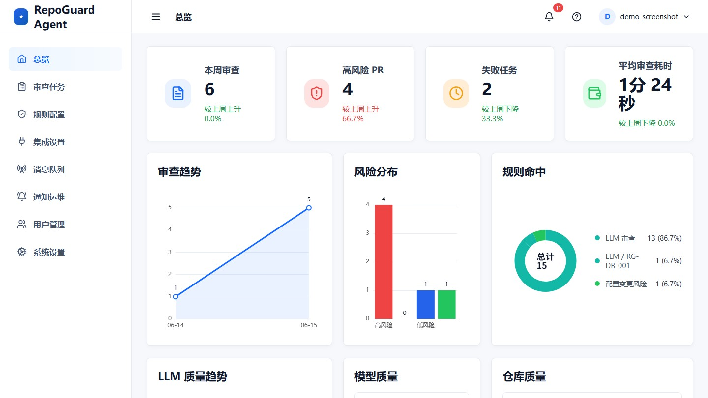
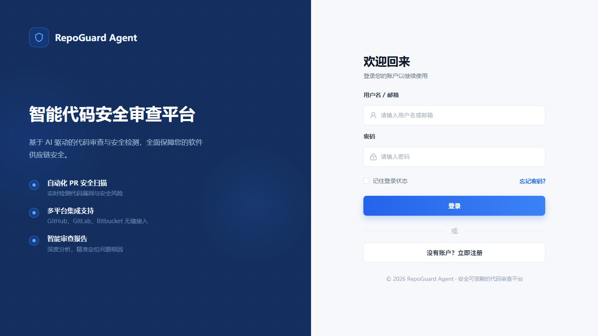
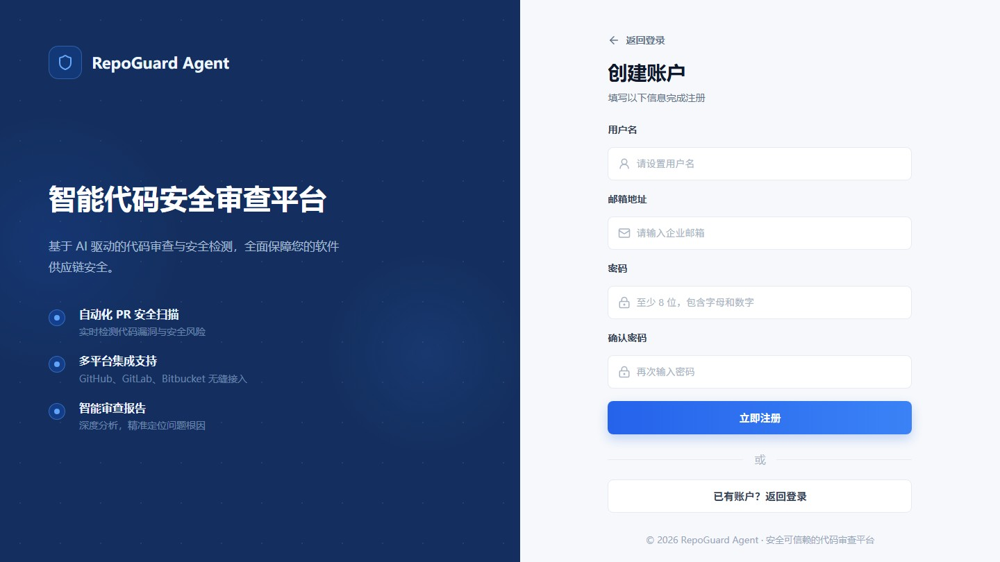

# PRAgent

RepoGuard Agent 是面向 GitHub Pull Request 的代码审查辅助系统，包含 Spring Boot 后端与 Vue 3 管理台。系统通过 RabbitMQ 异步执行审查任务，拉取 GitHub diff，结合规则和 LLM 生成审查发现，并支持结果展示、人工确认、评论预览、GitHub 回写和运维观测。

## 核心功能

- PR 审查任务创建、重试、状态追踪和详情展示。
- GitHub open PR 选择、diff 拉取、行评论和 PR 总评回写。
- 规则审查与 LLM 审查结合，支持 fallback、结果解析、finding 去重和风险画像。
- RabbitMQ 异步执行、发布确认、失败补偿、死信/异常任务运维。
- 用户认证、管理员 API Key、RBAC、审计日志和敏感配置加密。
- Dashboard 指标、LLM 质量趋势、通知运维、消息队列健康和日志观测。

## 界面预览







## 技术栈

后端：

- Java 25
- Spring Boot 4
- MyBatis-Plus
- MySQL 8 + Flyway
- RabbitMQ
- Micrometer / Actuator
- JUnit / Mockito / Spring Test

前端：

- Node.js >= 20.19.0
- Vue 3
- Vite 7
- TypeScript
- Element Plus
- ECharts
- lucide-vue-next

## 项目结构

- `repoguard-backend/`：Spring Boot 后端，提供审查任务、配置、GitHub 集成、LLM/规则审查、评论回写和运维 API。
- `repoguard-frontend/`：Vue 3 + Vite + TypeScript 前端管理台。
- `config/`：本地和示例配置。

## 环境要求

- JDK：25
- Maven：3.9.9+（低于 4.0.0）
- Node.js：建议使用 Node 22，最低要求 `>=20.19.0`
- Docker / Docker Compose：用于启动 MySQL、RabbitMQ 和本地观测组件

仓库根目录提供 `.nvmrc`，前端开发建议使用该版本。

## 快速启动

启动后端依赖：

```bash
cd repoguard-backend
docker compose up -d
```

启动后端：

```bash
cd repoguard-backend
mvn spring-boot:run -Dspring-boot.run.profiles=dev,local
```

默认后端地址：

```text
http://localhost:8081
```

启动前端：

```bash
cd repoguard-frontend
npm install
npm run dev
```

默认前端地址：

```text
http://localhost:5173
```

前端开发服务默认通过 Vite `/api` 代理访问后端 `http://localhost:8081`。

## 常用命令

后端全量测试：

```bash
cd repoguard-backend
mvn test
```

后端打包：

```bash
cd repoguard-backend
mvn -DskipTests package
```

前端构建：

```bash
cd repoguard-frontend
npm run build
```

前端开发：

```bash
cd repoguard-frontend
npm run dev
```

## 配置说明

常用环境变量：

- `SPRING_PROFILES_ACTIVE`
- `SPRING_RABBITMQ_HOST`
- `SPRING_RABBITMQ_PORT`
- `SPRING_RABBITMQ_USERNAME`
- `SPRING_RABBITMQ_PASSWORD`
- `MYSQL_ROOT_PASSWORD_FILE`
- `MYSQL_PASSWORD_FILE`
- `REPOGUARD_SECURITY_ENCRYPTION_KEY_FILE`
- `REPOGUARD_SECURITY_ENCRYPTION_KEY_ID`
- `REPOGUARD_SECURITY_ENCRYPTION_SALT_FILE`
- `REPOGUARD_SECURITY_ALLOW_PLAINTEXT_SECRETS`
- `REPOGUARD_AUTH_TOKEN_SECRET_FILE`
- `REPOGUARD_AUTH_TOKEN_SECRET_ID`
- `REPOGUARD_AUTH_TOKEN_SECRET_PREVIOUS`
- `REPOGUARD_AUTH_TOKEN_SECRET_PREVIOUS_ID`
- `REPOGUARD_ADMIN_API_KEY_FILE`
- `REPOGUARD_GITHUB_WEBHOOK_SECRET_FILE`
- `REPOGUARD_GITHUB_WEBHOOK_ALLOWED_REPOSITORIES`
- `REPOGUARD_GITHUB_WEBHOOK_ALLOWED_HEAD_BRANCHES`
- `REPOGUARD_GITHUB_WEBHOOK_REQUIRE_SIGNATURE`
- `REPOGUARD_GITHUB_WEBHOOK_IGNORE_DRAFT`
- `REPOGUARD_RUNTIME_ROLE`
- `REPOGUARD_DEPLOYMENT_MODE`
- `REPOGUARD_API_INSTANCE_COUNT`
- `REPOGUARD_REVIEW_WORKER_CONCURRENCY`

敏感配置要求：

- GitHub Token、LLM API Key、数据库密码、RabbitMQ 密码等不得提交到仓库。
- 本地 `application-local.yml`、真实 `.env`、真实密钥文件不得提交。
- 生产环境必须使用独立加密密钥、认证 Token 密钥和 GitHub Webhook Secret。

运行角色与横向扩展边界：

- `REPOGUARD_RUNTIME_ROLE` 只接受 `combined`、`api`、`worker`。`combined` 同时提供 HTTP API、RabbitMQ 消费者和受数据库栅栏保护的定时任务；`worker` 同时承载消费者与这些定时任务。
- `REPOGUARD_DEPLOYMENT_MODE` 只接受 `monolith`、`split`。`monolith` 必须搭配 `combined`；`split` 的 API 容器必须使用 `api`，Worker 容器固定使用 `worker`。配置冲突会在 Spring 启动或生产部署拉取镜像前失败。
- 当前认证/Webhook 限流和 Dashboard 快照仍是进程本地状态，因此 API/combined 角色要求 `REPOGUARD_API_INSTANCE_COUNT=1`。迁移到共享限流与跨节点缓存失效前，不允许横向扩展 API。认证限流阈值（`REPOGUARD_AUTH_REQUESTS_PER_MINUTE_PER_IP`、`REPOGUARD_AUTH_REQUESTS_PER_MINUTE_PER_ACCOUNT_IP`）为单实例语义，若未来放开横向扩展需按实例数调低；实际生效阈值会在 API 启动日志中打印。
- Worker 执行链路具备 RabbitMQ、数据库 CAS、领取标识和租约保护，可由编排平台扩展多个实例；当前生产 Compose 仍固定为单个 Worker 服务。所有 `@Scheduled` 入口由 Scheduler 能力契约保护，避免与普通消息消费者的装配边界混淆。
- 旧 `REPOGUARD_API_ENABLED`、`REPOGUARD_WORKER_ENABLED` 仅保留迁移兼容；新部署应改用单一角色变量。生产部署脚本会根据 Compose 服务集合推导并验证 `monolith/split`。

## 镜像发布与回滚

生产发布通过 GitHub Actions 的 `Release Images` workflow 执行。镜像会推送到 GHCR 和阿里云 ACR，生产服务器部署时从阿里云 ACR 拉取镜像。

RepoGuard 通过 GitHub `pull_request` webhook 自动创建审查任务。当前自动建 PR workflow 只监听 `PRAgent-test` 分支 push，并自动创建或复用指向 `main` 的 PR。生产环境建议将 `REPOGUARD_GITHUB_WEBHOOK_ALLOWED_REPOSITORIES` 配置为当前 GitHub 仓库全名，并保持 `REPOGUARD_GITHUB_WEBHOOK_ALLOWED_HEAD_BRANCHES=PRAgent-test`。

需要在 GitHub Actions Repository secrets 或 variables 中配置：

- `ALIYUN_REGISTRY`
- `ALIYUN_DEPLOY_REGISTRY`
- `ALIYUN_NAMESPACE`
- `ALIYUN_REPOSITORY`
- `ALIYUN_REGISTRY_USERNAME`
- `ALIYUN_REGISTRY_PASSWORD`
- `DEPLOY_HOST`
- `DEPLOY_USER`
- `DEPLOY_PORT`
- `DEPLOY_PATH`
- `DEPLOY_SSH_KEY`
- `REPOGUARD_BACKUP_ENCRYPTION_PASSWORD`

正常发布：

1. 打开 GitHub Actions。
2. 选择 `Release Images`。
3. 点击 `Run workflow`。
4. 分支选择 `main`。
5. 勾选 `Deploy to the configured server after pushing images`。
6. 运行 workflow。

快速回滚：

1. 打开 `Release Images` 的 `Run workflow`。
2. 分支选择 `main`。
3. 在 `Existing image tag to deploy without rebuilding, for rollback` 填入已有镜像 tag，例如 `main-<commit12>`。
4. 勾选 `Deploy to the configured server after pushing images`。
5. 运行 workflow。

填写 `deploy_existing_tag` 时，workflow 会跳过镜像构建，直接部署 ACR 中已有的 `backend-<tag>` 和 `frontend-<tag>` 镜像。部署脚本会校验实际运行容器镜像与目标镜像一致，并在健康检查失败时输出后端最近日志。

## 生产运维 Runbook

### 部署前检查与密钥文件迁移

生产 Compose 使用服务器本地文件提供 MySQL 密码和 5 个应用密钥；RabbitMQ 口令暂时保留在 `.env`。密钥目录必须为 `0700`，文件必须为 `0400` 或 `0600`、非空、非符号链接，且末尾不能带 CR/LF。部署脚本在拉取镜像或停止容器前检查这些条件，并拒绝包含 Grafana/Loki/Alloy 上游的边缘配置。

从旧版明文 `.env` 迁移时，不要生成新值；必须把当前正在使用的原值逐字节写入对应文件，否则已有数据库、Token 和加密业务配置会失效：

```bash
cd /opt/repoguard
umask 077
install -d -m 700 secrets
printf '%s' '<原 MYSQL_ROOT_PASSWORD>' > secrets/mysql.root-password
printf '%s' '<原 MYSQL_PASSWORD>' > secrets/spring.datasource.password
printf '%s' '<原 REPOGUARD_SECURITY_ENCRYPTION_KEY>' > secrets/repoguard.security.encryption-key
printf '%s' '<原 REPOGUARD_SECURITY_ENCRYPTION_SALT>' > secrets/repoguard.security.encryption-salt
printf '%s' '<原 REPOGUARD_AUTH_TOKEN_SECRET>' > secrets/repoguard.auth.token-secret
printf '%s' '<原 REPOGUARD_ADMIN_API_KEY>' > secrets/app.security.admin-api-key.key
printf '%s' '<原 REPOGUARD_GITHUB_WEBHOOK_SECRET>' > secrets/app.github.webhook.secret
chmod 600 secrets/*
```

随后把 `.env` 中上述明文键替换为以下文件路径键；确认新容器健康、登录/Webhook/集成配置解密和一次备份恢复均正常后，再删除服务器上的受限迁移副本：

```dotenv
MYSQL_ROOT_PASSWORD_FILE=./secrets/mysql.root-password
MYSQL_PASSWORD_FILE=./secrets/spring.datasource.password
REPOGUARD_SECURITY_ENCRYPTION_KEY_FILE=./secrets/repoguard.security.encryption-key
REPOGUARD_SECURITY_ENCRYPTION_SALT_FILE=./secrets/repoguard.security.encryption-salt
REPOGUARD_AUTH_TOKEN_SECRET_FILE=./secrets/repoguard.auth.token-secret
REPOGUARD_ADMIN_API_KEY_FILE=./secrets/app.security.admin-api-key.key
REPOGUARD_GITHUB_WEBHOOK_SECRET_FILE=./secrets/app.github.webhook.secret
```

每次发布前执行：

```bash
cd /opt/repoguard
sh -n scripts/deploy-prod.sh
docker compose --env-file .env -f docker-compose.prod.yml config --quiet
BACKEND_IMAGE='<目标后端镜像>' FRONTEND_IMAGE='<目标前端镜像>' \
  ENV_FILE=.env PREFLIGHT_ONLY=true sh scripts/deploy-prod.sh
```

再通过 `Release Images` 执行发布。不要使用 `source .env`，不要把密钥放入命令参数、shell 历史、容器环境或 Git；部署工作流不会上传、备份或覆盖服务器的 `secrets/`。

### 发布失败与回滚

- 部署预检失败时尚未修改运行服务，先按首条错误修复文件、权限、角色或 Compose 配置后重试。
- 预检后的发布失败会触发 `scripts/deploy-prod.sh` 自动回滚：先恢复上一版 Compose/Caddy/RabbitMQ 配置，再恢复上一版后端、Worker 和前端镜像，并重新校验健康与发布标识。
- 自动回滚仍不健康时，保留现场，执行 `docker compose --env-file .env -f docker-compose.prod.yml ps` 和 `logs --tail=200 backend backend-worker`；不要执行 `down -v` 或清理 MySQL/RabbitMQ 卷。
- 需要人工回滚时，在 `Release Images` workflow 选择 `main`，填写已验证的 `deploy_existing_tag` 并启用部署。回滚不恢复或轮换密钥文件；密钥变更必须作为独立变更处理。

### 密钥轮换与明文配置迁移

- Token 密钥轮换：把当前文件值和当前 ID 临时配置为 `REPOGUARD_AUTH_TOKEN_SECRET_PREVIOUS` / `REPOGUARD_AUTH_TOKEN_SECRET_PREVIOUS_ID`，用临时文件加 `mv` 原子替换 `repoguard.auth.token-secret`，更新活动 ID并强制重建 API/Worker；至少等待一个 access-token TTL 后清空 previous 对。previous 值在轮换窗口内仍属于 `.env` 残余风险，窗口结束必须删除。
- 主加密密钥轮换：先完成数据库备份和恢复验证，在维护窗口调用 `/api/v1/config/secrets/re-encryption` 做 `execute=false` 预演；失败数为 0 后使用 `confirmText=RE-ENCRYPT` 执行，立即原子替换密钥文件、更新 key ID并重建后端。新实例验证所有集成配置可解密前保留旧密钥的离线副本。
- 历史明文业务密钥迁移：仅在维护窗口临时设置 `REPOGUARD_SECURITY_ALLOW_PLAINTEXT_SECRETS=true`，通过同一重加密接口完成预演与执行；确认扫描结果无明文、无失败后立刻恢复为 `false` 并重建后端。

### MySQL 恢复

- 日常使用 `Production MySQL Backup` workflow；只有加密、SHA-256 校验、隔离恢复和逐表检查全部成功的备份才可作为恢复点。
- 恢复前记录目标镜像 tag、备份文件和校验文件 SHA-256，停止业务写入；先在 `--network none` 的临时 MySQL 容器和临时卷中恢复验证，禁止直接把未验证 SQL 导入生产卷。
- 生产恢复必须在独立维护窗口执行，保留原卷只读快照或可回切副本；恢复后校验表集合、精确行数、`CHECK TABLE`、Flyway 版本和外部 `/actuator/health`，最后再恢复流量。

### RabbitMQ 堆积与出箱补偿

- 先查看管理台“消息队列”或 `GET /api/v1/message-queue/health`，区分 `publish_failed`、`requeue_pending`、执行超时和 DLQ；同时检查 RabbitMQ/Worker 健康、磁盘和消费者数。
- 先修复根因，再通过受管理端点 `POST /api/v1/message-queue/tasks/{taskId}/requeue` 逐项重入队。不得直接清空队列、批量修改任务状态或重复投递仍在领取租约内的任务。
- 评审发布由 `next_publish_retry_at` 和补偿器自动重试；通知发布查看通知事件页，修复通道后使用 `POST /api/v1/notification-events/{id}/retry`。若补偿量持续上升，保留数据库出箱行并检查 `review_publish_compensation` / `notification_publish_compensation` 日志，不要绕过状态机直发 RabbitMQ。

### Grafana 访问与 Worker 扩容边界

Grafana 只绑定服务器 `127.0.0.1:3000`，应用 Nginx/Caddy 不提供 `/grafana` 公网路径。使用 SSH 隧道访问：

```bash
ssh -N -L 3000:127.0.0.1:3000 <deploy-user>@<production-host>
```

本机打开 `http://127.0.0.1:3000`。不得把 Grafana 端口改为 `0.0.0.0`；确需 Web 入口时必须先增加 SSO 或 IP allowlist，并单独评审拓扑。

API 仍固定 `REPOGUARD_API_INSTANCE_COUNT=1`。吞吐不足时先观测数据库连接、RabbitMQ 未确认消息、LLM bulkhead 和内存，再小步调整 `REPOGUARD_REVIEW_WORKER_CONCURRENCY`；需要进程隔离时启用 `worker-split`。当前 Compose 的固定 `container_name` 只支持一个 Worker 服务，不得直接使用 `--scale`；多 Worker 实例要先移除固定名称、验证日志采集规则和容量预算，且不能横向扩展 API。

## 生产数据库备份

生产 MySQL 逻辑备份通过 GitHub Actions 的 `Production MySQL Backup` workflow 执行：每天北京时间 03:30（UTC 19:30）自动运行，也可手动触发。工作流复用 production environment 的 SSH 部署凭据，把受限备份与轮换脚本上传到服务器后运行；数据库密码只在 MySQL 容器内部通过 `MYSQL_PWD` 使用，备份加密密码只通过 SSH 标准输入传递，两者均不会写入命令参数或日志。定时运行强制执行隔离恢复验证；手动关闭恢复验证时不会执行保留策略。

- 备份以 `--single-transaction --quick --routines --triggers --events` 创建一致性逻辑快照，经 gzip 压缩后使用 AES-256-CBC、PBKDF2-SHA-256 和 200000 次迭代加密。
- 加密文件和独立 SHA-256 校验文件保存到服务器 `/opt/repoguard/backups/mysql/`，目录权限为 `0700`；工作流不上传业务数据到 GitHub Artifact。
- 默认在无网络、限制 CPU/内存的临时 MySQL 容器和专用临时卷中恢复，校验源库与恢复库的表数量及表名集合，逐表执行 `CHECK TABLE`，并记录加密文件与解密逻辑转储的 SHA-256 指纹和恢复库精确行数。
- 临时容器、临时卷和中间文件在成功或失败时均按固定名称前缀清理；生产数据库只读，不创建演练 schema。
- 日常备份仅在新备份加密校验、隔离恢复和生产外部健康检查均成功后执行保留策略；轮换前会校验根目录全部日常备份与 `.sha256` 文件一一对应且内容一致，按 UTC 文件名倒序保留最近 7 份。`/opt/repoguard/backups/mysql/legacy/` 被固定排除，不参与自动删除；轮换后再次检查备份数量、当前备份 SHA-256 和生产健康。
- 历史明文备份通过 `Production MySQL Legacy Backup Migration` workflow 处理：先以 `inventory` 只读盘点顶层 `.sql` 的路径、大小、修改时间和 SHA-256，并区分空文件与可迁移备份；再以 `encrypt` 仅对非空文件在 `/opt/repoguard/backups/mysql/legacy/` 创建加密副本，并校验密文 SHA-256 与解密后源文件 SHA-256 完全一致。该流程不删除明文；删除必须在核对精确清单后单独确认。
- 不要直接轮换 `REPOGUARD_BACKUP_ENCRYPTION_PASSWORD`。轮换前必须先重新加密仍需保留的历史备份，并在密码管理器中保存恢复密钥副本。

## API 入口

主要后端接口前缀为 `/api/v1`：

- `/api/v1/auth/**`：注册、登录、刷新、当前用户、登出。
- `/api/v1/dashboard/**`：总览统计、趋势、风险分布、通知摘要。
- `/api/v1/reviews/**`：审查任务列表、详情、手动触发、重试、评论预览与回写。
- `/api/v1/github/webhooks`：GitHub `pull_request` webhook 自动触发审查任务。
- `/api/v1/config/**`：系统设置、集成配置、连接测试、密钥重加密。
- `/api/v1/message-queue/**`：RabbitMQ 健康、异常任务、重新入队。
- `/api/v1/users/**`：用户管理。
- `/actuator/health`、`/actuator/info`、`/actuator/metrics`：健康检查和指标。

API 响应通常使用统一 `ApiResponse` 包装。业务错误优先使用稳定 `ErrorCode`。

## 本地日志观测

本地可以使用 Loki + Alloy + Grafana 查看 RepoGuard 日志。Linux 主机需先把 Docker Socket 的实际组 ID 和 Grafana 管理员密码放入当前 shell；Alloy 只通过内部只读 API 代理采集容器日志，不直接挂载 Docker Socket：

```bash
export DOCKER_SOCKET_GID="$(stat -c '%g' /var/run/docker.sock)"
export GRAFANA_ADMIN_PASSWORD='请设置一个独立强密码'
docker compose -f docker-compose.observability.yml up -d
```

Grafana 地址：

```text
http://localhost:3000
```

默认账号：`admin`

密码为启动前显式设置的 `GRAFANA_ADMIN_PASSWORD`；首次使用后建议立即修改。

如果后端通过 Maven 或 IDE 本地启动，建议让日志写入仓库根目录的 `logs/backend`：

```powershell
cd repoguard-backend
$env:REPOGUARD_LOG_PATH = "../logs/backend"
mvn spring-boot:run
```

Grafana 的 Explore 页面选择 `Loki` 数据源后，可以用这些查询：

```logql
{service="repoguard-backend"}
{service="repoguard-backend"} |= "ERROR"
{container="repoguard-backend"}
{container="repoguard-backend"} |= "traceId=<X-Trace-Id>"
{container="repoguard-backend"} |= "operation=review_execute"
{container="repoguard-backend"} |= "operation=github_diff_fetch"
{container="repoguard-backend"} |= "failureCategory="
```

也可以打开 Grafana Dashboard：

```text
RepoGuard / RepoGuard Review Observability
```

该看板支持按 `taskId`、`traceId`、`operation` 过滤审查链路日志。

## 开发规范

- 提交信息使用 `<type>(<scope>): <中文摘要>` 格式。
- 提交前按影响范围运行后端测试、前端类型检查或前端构建。
- 不提交本地日志、临时脚本、真实密钥、真实 token、真实连接信息。
- 生产准出完整门禁可执行 `powershell -ExecutionPolicy Bypass -File scripts/production-readiness-check.ps1`，覆盖空白、Flyway migration、敏感信息扫描、后端关键测试集合、前端质量门禁和前端生产构建。
- 轻量仓库治理可执行 `powershell -ExecutionPolicy Bypass -File scripts/production-readiness-check.ps1 -Mode quick -SkipBackendTests`，用于只检查 tracked 文件治理、Flyway migration、demo data guard 和敏感信息扫描；旧参数 `-IncludeFrontendBuild` 仍兼容并等价于完整模式。
- 准出门禁、失败处理、回滚与恢复步骤统一维护在本文“生产运维 Runbook”。

## 优化进度

- 2026-07-30 04:06:48（Asia/Shanghai）：完成演进方案架构降债批次 D 第四项第四阶段。将 `ReviewRuleConfigServiceImpl`、`ReviewRuleConfigPolicy`、`ReviewRuleMetricAssembler` 及三组直接测试从通用 `service.impl` 迁入 `review.config`，使规则配置 CRUD、归一化/排序策略、命中与人工反馈统计和指标 DTO 装配形成明确评审配置边界；`SystemConfigServiceImplTest` 仅补充新包导入。迁移未改业务行为：规则 ID、严重级别与状态归一化，重复 ID 和路径/请求 ID 一致性校验，排序号按 10 递增，创建/更新/启停、事务提交后规则缓存失效，命中数和有效/误报统计，启用/高风险/累计命中/平均置信度/有效率/误报率六项指标及日期格式均保持不变。`service.impl` 生产源文件由 23 降至既定目标 20，`notification` 顶层仍为 8，循环依赖审查基线仍为 17；新增三个评审配置类型不得回流 `service.impl` 的架构守卫并下调数量棘轮。定向回归 85 项通过；本机 JDK 26 按 Java 25 目标编译并仅跳过精确 JDK 25 Enforcer 后，后端干净全量 `mvn clean verify` 共 1983 项测试通过（0 失败、0 错误、6 跳过，759 个类覆盖率门禁通过），前端 typecheck、Lint、35 个测试文件共 136 项测试、生产构建、bundle budget 和完整 production-readiness 门禁通过。Gitleaks 暂存差异及 969 个提交全历史扫描通过。代码提交 `68830c30` 推送后，[Release Images](https://github.com/cocojiu/PRAgent/actions/runs/30486850824)、[Pull Request Quality](https://github.com/cocojiu/PRAgent/actions/runs/30486853972)、[Production Observability Image Security](https://github.com/cocojiu/PRAgent/actions/runs/30486854098)、两次 Repository Governance 与 Auto Create Pull Request 共 6 个 GitHub Actions 运行全部成功。`service.impl <= 20` 阶段目标完成，下一阶段转入约 750 行的 `GithubCommentWriter` 热点拆分，先审计批量 review、单行评论降级和 superseded 汇总职责。
- 2026-07-30 03:52:01（Asia/Shanghai）：完成演进方案架构降债批次 D 第四项第三阶段。将 `NotificationIntegrationServiceImpl` 与直接测试从通用 `service.impl` 迁入 `notification.facade`，将 `NotificationServiceImpl` 与直接测试迁入 `notification.center`，分别形成通知运维 API 编排边界和站内通知展示边界，避免两个用户侧入口继续与无关服务实现平铺。迁移仅调整包归属；绑定增删改/启停/连接测试与事件/投递查询/重试的接口委派保持不变；通知中心仍只读取最近 50 个任务，分别最多抽取失败 4 条、高风险 4 条、LLM 降级 3 条，叠加 GitHub、RabbitMQ 和 LLM 配置/健康告警后按时间倒序限制为 12 条，目标路由、相对时间、异常摘要 120 字符限制和配置缺失/检查失败语义均保持不变。`service.impl` 生产源文件由 25 降至 23，`notification` 顶层仍为 8，循环依赖审查基线仍为 17；新增两个用户侧服务不得回流 `service.impl` 的架构守卫并下调数量棘轮。定向回归 51 项通过；本机 JDK 26 按 Java 25 目标编译并仅跳过精确 JDK 25 Enforcer 后，后端干净全量 `mvn clean verify` 共 1982 项测试通过（0 失败、0 错误、6 跳过，759 个类覆盖率门禁通过），前端 typecheck、Lint、35 个测试文件共 136 项测试、生产构建、bundle budget 和完整 production-readiness 门禁通过。Gitleaks 暂存差异及 967 个提交全历史扫描通过。代码提交 `2226be3e` 推送后，[Release Images](https://github.com/cocojiu/PRAgent/actions/runs/30485929277)、[Pull Request Quality](https://github.com/cocojiu/PRAgent/actions/runs/30485933837)、[Production Observability Image Security](https://github.com/cocojiu/PRAgent/actions/runs/30485933839)、两次 Repository Governance 与 Auto Create Pull Request 共 6 个 GitHub Actions 运行全部成功。下一阶段收拢评审规则配置、配置策略和指标装配边界，把 `service.impl` 棘轮降至 20。
- 2026-07-30 03:38:31（Asia/Shanghai）：完成演进方案架构降债批次 D 第四项第二阶段。将 `NotificationEventQueryServiceImpl`、`NotificationEventResponseAssembler` 及两组直接测试从通用 `service.impl` 迁入既有 `notification.query`，使事件/投递分页、手工重试编排、投递摘要与响应 DTO 装配同候选绑定、可投递事件和成功投递查询协作者归入同一查询边界。迁移仅调整包归属；状态去空白并转大写、任务筛选与时间倒序、按事件批量加载投递日志、provider 去重归一化、失败数和最新状态汇总、日期格式、仅允许 `PUBLISH_FAILED`/`DELIVERY_FAILED`/`DEAD` 且无发布领取的事件手工重试、CAS 条件更新、重试/领取字段重置、重新发布及并发拒绝语义均保持不变。`service.impl` 生产源文件由 27 降至 25，`notification` 顶层仍为 8，循环依赖审查基线仍为 17；新增两个事件查询类型不得回流 `service.impl` 的架构守卫并下调数量棘轮。定向回归 57 项通过；本机 JDK 26 按 Java 25 目标编译并仅跳过精确 JDK 25 Enforcer 后，后端干净全量 `mvn clean verify` 共 1981 项测试通过（0 失败、0 错误、6 跳过，759 个类覆盖率门禁通过），前端 typecheck、Lint、35 个测试文件共 136 项测试、生产构建、bundle budget 和完整 production-readiness 门禁通过。Gitleaks 暂存差异及 965 个提交全历史扫描通过。代码提交 `80161b15` 推送后，[Release Images](https://github.com/cocojiu/PRAgent/actions/runs/30484956150)、[Pull Request Quality](https://github.com/cocojiu/PRAgent/actions/runs/30484961717)、[Production Observability Image Security](https://github.com/cocojiu/PRAgent/actions/runs/30484960999)、两次 Repository Governance 与 Auto Create Pull Request 共 6 个 GitHub Actions 运行全部成功。下一阶段审计通知集成门面与通知中心服务，分别确认其 API 编排和用户通知展示边界。
- 2026-07-30 03:25:48（Asia/Shanghai）：完成演进方案架构降债批次 D 第四项第一阶段。将 `NotificationBindingConfigServiceImpl`、`NotificationBindingConnectionTestServiceImpl`、`NotificationBindingConnectionTestResultApplier`、`NotificationBindingRequestApplier`、`NotificationBindingResponseAssembler` 及五组直接测试从通用 `service.impl` 迁入 `notification.binding`，使绑定分页/增删改、请求应用、密钥处理、响应装配和连接测试状态回写与既有绑定状态/匹配原语归入同一业务边界。迁移仅调整包归属；分页筛选与软删除、provider 有效性校验、创建/更新/启停/删除、Webhook URL 必填与加密继承、出站端点和凭据换源校验、敏感字段掩码与加密状态、连接测试发送、成功/失败状态及 1024 字符错误截断、基于 `updated_at` 的条件回写防并发覆盖等语义均保持不变。`service.impl` 生产源文件由 32 降至 27，`notification` 顶层仍为 8，循环依赖审查基线仍为 17；新增五个绑定管理类型不得回流 `service.impl` 的架构守卫并下调数量棘轮。定向回归 65 项通过；本机 JDK 26 按 Java 25 目标编译并仅跳过精确 JDK 25 Enforcer 后，后端干净全量 `mvn clean verify` 共 1980 项测试通过（0 失败、0 错误、6 跳过，759 个类覆盖率门禁通过），前端 typecheck、Lint、35 个测试文件共 136 项测试、生产构建、bundle budget 和完整 production-readiness 门禁通过。Gitleaks 暂存差异及 963 个提交全历史扫描通过。代码提交 `36271073` 推送后，[Release Images](https://github.com/cocojiu/PRAgent/actions/runs/30483966326)、[Pull Request Quality](https://github.com/cocojiu/PRAgent/actions/runs/30483970677)、[Production Observability Image Security](https://github.com/cocojiu/PRAgent/actions/runs/30483970706)、两次 Repository Governance 与 Auto Create Pull Request 共 6 个 GitHub Actions 运行全部成功。下一阶段审计并收拢通知事件查询与响应装配边界，再评估通知集成门面的归属。
- 2026-07-30 03:10:43（Asia/Shanghai）：完成演进方案架构降债批次 D 第三项第十四阶段。将 `NotificationChannelAdapter`、`NotificationChannelAdapterRegistry`、`NotificationProviderKeyNormalizer` 及两组直接测试迁入 `notification.channel`，使渠道端口、Spring 适配器发现/索引与 provider 键归一化形成独立中立边界；Webhook 适配器、绑定投递、绑定配置和连接测试调用方仅调整导入，Spring 构造器反射契约同步更新。provider 去空白并转大写、空值/空白值处理、不支持 provider 时抛出 `BusinessException`、注册表通过 `List<NotificationChannelAdapter>` 自动发现适配器及按 provider 查找的行为均保持不变，Webhook 实现仍实现同一端口，投递与配置连接测试语义未改。`notification` 顶层生产源文件由 11 降至 8，`service.impl` 仍为 32，循环依赖审查基线仍为 17；新增三个渠道契约不得回流顶层的架构守卫并继续下调数量棘轮。定向回归 62 项通过；本机 JDK 26 按 Java 25 目标编译并仅跳过精确 JDK 25 Enforcer 后，后端干净全量 `mvn clean verify` 共 1979 项测试通过（0 失败、0 错误、6 跳过，759 个类覆盖率门禁通过），前端 typecheck、Lint、35 个测试文件共 136 项测试、生产构建、bundle budget 和完整 production-readiness 门禁通过。Gitleaks 暂存差异及 961 个提交全历史扫描通过。代码提交 `a19a91a6` 推送后，[Release Images](https://github.com/cocojiu/PRAgent/actions/runs/30482902763)、[Pull Request Quality](https://github.com/cocojiu/PRAgent/actions/runs/30482907392)、[Production Observability Image Security](https://github.com/cocojiu/PRAgent/actions/runs/30482907324)、两次 Repository Governance 与 Auto Create Pull Request 共 6 个 GitHub Actions 运行全部成功。下一阶段转入 `service.impl` 降债，优先审计通知绑定配置、请求应用、响应组装和连接测试协作者的闭合边界。
- 2026-07-30 02:53:34（Asia/Shanghai）：完成演进方案架构降债批次 D 第三项第十三阶段。依赖审计确认 Webhook 内容/请求辅助类型只服务于钉钉和企微适配器，若仅迁辅助类会迫使 6 个内部类型扩大公共可见性，因此将 `AbstractWebhookNotificationAdapter`、钉钉/企微适配器、`DingTalkWebhookSigner`、内容与字段格式化、载荷/请求构建、请求值对象、响应判定等 12 个生产类型及 8 组直接测试整体迁入 `notification.webhook`，形成从凭据解密和出站地址校验到签名、载荷构建、HTTP 调用、响应判定的闭合适配边界；同时删除两个具体适配器中从未使用的 `SecretCryptoService` 构造参数，真实凭据处理仍唯一归属 `WebhookNotificationRequestFactory`。`NotificationChannelAdapter`、注册表和 provider 归一化继续作为中立渠道契约留在顶层，共享 `NotificationMessage`、`NotificationEventType` 与 `NotificationTextLimiter` 也保持不变。连接/读取超时、RestClient 隔离、Webhook URL 解密和 allowlist 校验、钉钉 HMAC-SHA256 签名、钉钉/企微 Markdown 载荷、通知文本规范化、连接测试、HTTP 状态/Retry-After/响应体提取、敏感信息脱敏和 512 字符截断语义均保持不变。`notification` 顶层生产源文件由 23 降至 11，`service.impl` 仍为 32，循环依赖审查基线仍为 17；新增 12 个类型不得回流顶层的架构守卫并继续下调数量棘轮。定向回归 86 项通过；本机 JDK 26 按 Java 25 目标编译并仅跳过精确 JDK 25 Enforcer 后，后端干净全量 `mvn clean verify` 共 1978 项测试通过（0 失败、0 错误、6 跳过，759 个类覆盖率门禁通过），前端 typecheck、Lint、35 个测试文件共 136 项测试、生产构建、bundle budget 和完整 production-readiness 门禁通过。Gitleaks 暂存差异、相对 1 个既有脱敏测试夹具的候选快照增量及 960 个提交全历史扫描通过。代码提交 `3c601ec5` 推送后，[Release Images](https://github.com/cocojiu/PRAgent/actions/runs/30481598647)、[Pull Request Quality](https://github.com/cocojiu/PRAgent/actions/runs/30481601346)、[Production Observability Image Security](https://github.com/cocojiu/PRAgent/actions/runs/30481601435)、两次 Repository Governance 与 Auto Create Pull Request 共 6 个 GitHub Actions 运行全部成功。下一阶段迁移 `NotificationChannelAdapter`、`NotificationChannelAdapterRegistry` 与 `NotificationProviderKeyNormalizer` 到 `notification.channel`，随后转入 `service.impl` 降债。
- 2026-07-30 02:32:52（Asia/Shanghai）：完成演进方案架构降债批次 D 第三项第十二阶段。将 `NotificationEventPublishCoordinator`、`NotificationEventPublishCompensator`、`NotificationPublishFailurePolicy`、`NotificationPublishResult`、`NotificationPublishExecutor`、专用 `NotificationPublishExecutorConfig` 及三组直接测试迁入 `notification.publish`，使事务提交后调度、发布领取与执行、失败决策、补偿调度、执行器容量配置和结果反馈形成同一发布编排边界；专用配置随执行器迁移，避免复制 `notificationPublishWorkerExecutor` 限定符或扩大公共可见性。`NotificationEventPublisher` 与 Rabbit 实现继续作为独立发布端口/适配器留在顶层，AMQP `NotificationEventMessage` 的 FQN、共享 `NotificationEventStatus` 和 `NotificationTextLimiter` 也保持不变。调用方仅调整导入、生产配置源码契约、Spring 反射类名与协调器的必要跨包可见性；afterCommit、执行器拒绝时保留待补偿事件、CAS 发布领取、单次 Rabbit 发布、发布成功/失败/死亡状态迁移、重试计划、补偿批量与租约、RecoveryWorkDispatcher 隔离、指标记录、Scheduler 运行角色及专用线程/队列容量语义均保持不变，协调器和补偿器日志分类显式维持原顶层名称。`notification` 顶层生产源文件由 29 降至 23，`service.impl` 仍为 32，循环依赖审查基线仍为 17；新增六个发布编排类型不得回流顶层的架构守卫并继续下调数量棘轮。定向回归 80 项通过；本机 JDK 26 按 Java 25 目标编译并仅跳过精确 JDK 25 Enforcer 后，后端干净全量 `mvn clean verify` 共 1977 项测试通过（0 失败、0 错误、6 跳过，759 个类覆盖率门禁通过），前端 typecheck、Lint、35 个测试文件共 136 项测试、生产构建、bundle budget 和完整 production-readiness 门禁通过。Gitleaks 暂存差异、相对 1 个既有脱敏测试夹具的候选快照增量及 958 个提交全历史扫描通过。代码提交 `65322341` 推送后，[Release Images](https://github.com/cocojiu/PRAgent/actions/runs/30480030104)、[Pull Request Quality](https://github.com/cocojiu/PRAgent/actions/runs/30480033209)、[Production Observability Image Security](https://github.com/cocojiu/PRAgent/actions/runs/30480034217)、两次 Repository Governance 与 Auto Create Pull Request 共 6 个 GitHub Actions 运行全部成功。下一阶段盘点 `WebhookNotificationContent`、内容/字段格式化器、载荷/请求工厂、请求值对象和响应判定器组成的纯 Webhook 构建组，渠道适配器及共享端口继续保持独立。
- 2026-07-30 02:12:23（Asia/Shanghai）：完成演进方案架构降债批次 D 第三项第十一阶段。将 `NotificationOutboxEventStore`、`NotificationPublishCompensationQuery`、`NotificationPublishEventStateUpdater`、`NotificationPublishFailureDecision` 及三组专用测试迁入 `notification.outbox`，使出箱事件创建/读取、到期补偿查询、发布领取与状态回写形成同一持久化状态边界；`NotificationEventPublishCoordinator` 有意继续留在 `notification` 顶层，避免把仍依赖顶层发布策略、执行器和结果类型的编排链路混入本阶段，投递与发布共享的 `NotificationEventStatus` 也继续作为中立状态契约留在顶层。调用方仅调整导入、Spring 构造器反射类名与跨包可见性；事件键重复幂等、`PENDING` 创建与时间戳、到期状态/租约/最大尝试次数/批量上限筛选、CAS 发布领取栅栏、`PUBLISHING/PUBLISHED/PUBLISH_FAILED/DEAD` 状态迁移、重试次数/下次重试时间/错误信息以及领取所有权校验和释放语义均保持不变。`notification` 顶层生产源文件由 33 降至 29，`service.impl` 仍为 32，循环依赖审查基线仍为 17；新增四个发布状态类型不得回流顶层的架构守卫并继续下调数量棘轮。定向回归 65 项通过；本机 JDK 26 按 Java 25 目标编译并仅跳过精确 JDK 25 Enforcer 后，后端干净全量 `mvn clean verify` 共 1976 项测试通过（0 失败、0 错误、6 跳过，759 个类覆盖率门禁通过），前端 typecheck、Lint、35 个测试文件共 136 项测试、生产构建、bundle budget 和完整 production-readiness 门禁通过。Gitleaks 暂存差异、相对 1 个既有脱敏测试夹具的候选快照增量及 956 个提交全历史扫描通过。代码提交 `6310cfa8` 推送后，[Release Images](https://github.com/cocojiu/PRAgent/actions/runs/30478413157)、[Pull Request Quality](https://github.com/cocojiu/PRAgent/actions/runs/30478415689)、[Production Observability Image Security](https://github.com/cocojiu/PRAgent/actions/runs/30478415575)、两次 Repository Governance 与 Auto Create Pull Request 共 6 个 GitHub Actions 运行全部成功。下一阶段盘点并收拢 `NotificationEventPublishCoordinator`、`NotificationEventPublishCompensator`、`NotificationPublishFailurePolicy`、`NotificationPublishResult` 与 `NotificationPublishExecutor` 的最小发布编排边界，Rabbit 发布适配器和渠道适配器继续保持独立。
- 2026-07-30 01:51:08（Asia/Shanghai）：完成演进方案架构降债批次 D 第三项第十阶段。将 `NotificationDeliveryWorker`、`NotificationEventPayloadParser` 及两组专用测试迁入 `notification.delivery`，使 Rabbit 消费入口与持久化通知载荷解析归入投递边界；发布端与消费端共享的 `NotificationEventMessage` 则有意继续保留在 `notification` 顶层，因为当前 `JacksonJsonMessageConverter` 会把其 FQN 写入 AMQP `__TypeId__`，直接迁包会破坏滚动发布期间在途消息的反序列化兼容性，并新增固定类名与类型头的回归测试。监听队列与并发配置、Worker 运行角色、消息字段、ACK/Reject 且不重入队、失败分类与消费指标、领取—解析—批量投递—完成链路、解析失败异常语义均保持不变；Worker 日志分类也显式维持原 `com.repoguard.agent.notification.NotificationDeliveryWorker` 名称。`notification` 顶层生产源文件由 35 降至 33，`service.impl` 仍为 32，循环依赖审查基线仍为 17；新增消费入口不得回流顶层且线协议位置保持稳定的架构守卫并继续下调数量棘轮。定向回归 62 项通过；本机 JDK 26 按 Java 25 目标编译并仅跳过精确 JDK 25 Enforcer 后，后端干净全量 `mvn clean verify` 共 1975 项测试通过（0 失败、0 错误、6 跳过，759 个类覆盖率门禁通过），前端 typecheck、Lint、35 个测试文件共 136 项测试、生产构建、bundle budget 和完整 production-readiness 门禁通过。Gitleaks 暂存差异、相对 1 个既有脱敏测试夹具的候选快照增量及 954 个提交全历史扫描通过。代码提交 `85099dec` 推送后，[Release Images](https://github.com/cocojiu/PRAgent/actions/runs/30476814194)、[Pull Request Quality](https://github.com/cocojiu/PRAgent/actions/runs/30476812743)、[Production Observability Image Security](https://github.com/cocojiu/PRAgent/actions/runs/30476813021)、两次 Repository Governance 与 Auto Create Pull Request 共 6 个 GitHub Actions 运行全部成功。下一阶段盘点 `NotificationEventPublishCoordinator`、`NotificationOutboxEventStore`、`NotificationPublishCompensationQuery` 与 `NotificationPublishEventStateUpdater` 的出箱发布状态边界，Rabbit 发布适配器和渠道适配器继续保持独立。
- 2026-07-30 01:32:51（Asia/Shanghai）：完成演进方案架构降债批次 D 第三项第九阶段。将 `NotificationBindingBatchDeliveryService`、`NotificationBindingDeliveryService`、`NotificationDeliveryLogFactory` 及三组专用测试迁入 `notification.delivery`，使候选绑定遍历、单绑定执行、发送结果汇总与投递日志构造归入同一执行边界；同时供发布失败和 Webhook 响应使用的 `NotificationTextLimiter` 继续留在顶层，仅为跨包调用放宽类与方法可见性。Worker 仅调整导入，候选绑定筛选、事件开关匹配、成功投递去重、渠道适配器选择与发送、投递日志持久化、成功/失败汇总、重试次数、失败原因 1024 字符截断和时间戳语义保持不变，未调整 Rabbit 消费、消息解析或渠道适配器实现。`notification` 顶层生产源文件由 38 降至 35，`service.impl` 仍为 32，循环依赖审查基线仍为 17；新增三个执行协作者不得回流顶层的架构守卫并继续下调数量棘轮。定向回归 54 项通过；本机 JDK 26 按 Java 25 目标编译并仅跳过精确 JDK 25 Enforcer 后，后端干净全量 `mvn clean verify` 共 1973 项测试通过（0 失败、0 错误、6 跳过，759 个类覆盖率门禁通过），前端 typecheck、Lint、35 个测试文件共 136 项测试、生产构建、bundle budget 和完整 production-readiness 门禁通过。Gitleaks 暂存差异、相对 1 个既有脱敏测试夹具的候选快照增量及 952 个提交全历史扫描通过。代码提交 `d0e66634` 推送后，[Release Images](https://github.com/cocojiu/PRAgent/actions/runs/30474864995)、[Pull Request Quality](https://github.com/cocojiu/PRAgent/actions/runs/30474869099)、[Production Observability Image Security](https://github.com/cocojiu/PRAgent/actions/runs/30474869083)、两次 Repository Governance 与 Auto Create Pull Request 共 6 个 GitHub Actions 运行全部成功。下一阶段盘点 `NotificationDeliveryWorker` 与 `NotificationEventPayloadParser` 的 Rabbit 消费/消息解析边界，并确认 `NotificationEventMessage` 是归入中立 messaging 契约还是继续留在顶层；渠道适配器继续保持独立。
- 2026-07-30 01:05:29（Asia/Shanghai）：完成演进方案架构降债批次 D 第三项第八阶段。将 `NotificationDeliveryClaimService`、`NotificationDeliveryCompletionService`、`NotificationDeliveryEventStateUpdater`、`NotificationDeliveryRecoveryCompensator` 及四组专用测试迁入 `notification.delivery`，使可投递查询后的 CAS 领取、完成决策落库、领取所有权校验和过期领取恢复形成同一状态生命周期边界。Worker 仅调整导入与跨包可见性；`PUBLISHING/PUBLISHED` 可领取状态、发布领取字段清理、`delivery_claimed_at/by` 所有权栅栏、成功/失败字段更新、租约与恢复批量上限、Scheduler 运行角色约束保持不变，未调整 Rabbit 消费、批量/单绑定投递、渠道适配或网络调用。`notification` 顶层生产源文件由 42 降至 38，`service.impl` 仍为 32，循环依赖审查基线仍为 17；新增四个状态协作者不得回流顶层的架构守卫并继续下调数量棘轮。定向回归 52 项通过；本机 JDK 26 按 Java 25 目标编译并仅跳过精确 JDK 25 Enforcer 后，后端干净全量 `mvn clean verify` 共 1972 项测试通过（0 失败、0 错误、6 跳过，759 个类覆盖率门禁通过），前端 typecheck、Lint、35 个测试文件共 136 项测试、生产构建、bundle budget 和完整 production-readiness 门禁通过。Gitleaks 暂存差异、相对 1 个既有脱敏测试夹具的候选快照增量及 949 个提交全历史扫描通过。代码提交 `16f0318e` 推送后，[Release Images](https://github.com/cocojiu/PRAgent/actions/runs/30473370921)、[Pull Request Quality](https://github.com/cocojiu/PRAgent/actions/runs/30473380282)、[Production Observability Image Security](https://github.com/cocojiu/PRAgent/actions/runs/30473377119)、两次 Repository Governance 与 Auto Create Pull Request 共 6 个 GitHub Actions 运行全部成功。下一阶段盘点 `NotificationBindingBatchDeliveryService`、`NotificationBindingDeliveryService` 与 `NotificationDeliveryLogFactory` 组成的绑定执行/日志闭合组，继续把 Rabbit Worker、消息解析和渠道适配留在独立批次。
- 2026-07-30 00:46:22（Asia/Shanghai）：完成演进方案架构降债批次 D 第三项第七阶段。将 `NotificationDeliveryCompletionDecider`、`NotificationDeliveryFailurePolicy` 及两组专用测试迁入 `notification.delivery`，将同时供投递日志、投递失败和发布失败使用的 `NotificationRetrySchedule` 及其测试迁入中立 `notification.retry`，避免发布链反向依赖投递边界。调用方仅调整导入、Spring 反射类名与跨包可见性，任一绑定失败判定、最多 5 次投递、1/5/15/30/60 分钟退避桶、投递日志尝试次数及发布失败重试时间语义保持不变，未改变领取、状态写入、恢复补偿或发布失败决策行为。`notification` 顶层生产源文件由 45 降至 42，`service.impl` 仍为 32，循环依赖审查基线仍为 17；新增决策策略与共享重试计划不得回流顶层的架构守卫并继续下调顶层数量棘轮。定向回归 67 项通过；本机 JDK 26 按 Java 25 目标编译并仅跳过精确 JDK 25 Enforcer 后，后端干净全量 `mvn clean verify` 共 1971 项测试通过（0 失败、0 错误、6 跳过，759 个类覆盖率门禁通过），前端 typecheck、Lint、35 个测试文件共 136 项测试、生产构建、bundle budget 和完整 production-readiness 门禁通过。Gitleaks 暂存差异、相对 1 个既有脱敏测试夹具的候选快照增量及 947 个提交全历史扫描通过。代码提交 `31d18dc9` 推送后，[Release Images](https://github.com/cocojiu/PRAgent/actions/runs/30471862172)、[Pull Request Quality](https://github.com/cocojiu/PRAgent/actions/runs/30471865162)、[Production Observability Image Security](https://github.com/cocojiu/PRAgent/actions/runs/30471864076)、两次 Repository Governance 与 Auto Create Pull Request 共 6 个 GitHub Actions 运行全部成功。下一阶段盘点并迁移 `NotificationDeliveryClaimService`、`NotificationDeliveryCompletionService`、`NotificationDeliveryEventStateUpdater` 与 `NotificationDeliveryRecoveryCompensator` 组成的领取/完成/状态写入/恢复闭合组，继续把 Worker、渠道适配和网络投递留在后续批次。
- 2026-07-30 00:18:25（Asia/Shanghai）：完成演进方案架构降债批次 D 第三项第六阶段。将 `NotificationDeliveryClaim`、`NotificationDeliveryCompletionDecision`、`NotificationDeliveryFailureDecision`、`NotificationDeliveryResultSummary`、`NotificationDeliveryStatus` 与 `NotificationSendResult` 六个投递值类型迁入 `notification.delivery`，结果摘要专用测试随类型迁移；调用方仅调整导入与跨包可见性，领取参数校验、完成/失败决策数据、成功失败计数与 `anyFailed` 判定、状态规范化及发送结果工厂语义保持不变，未迁移领取服务、完成/失败策略、状态写入器或恢复补偿器。`notification` 顶层生产源文件由 51 降至 45，`service.impl` 仍为 32，循环依赖审查基线仍为 17；新增六个投递值类型不得回流顶层的架构守卫并继续下调顶层数量棘轮。定向回归 92 项通过；本机 JDK 26 按 Java 25 目标编译并仅跳过精确 JDK 25 Enforcer 后，后端干净全量 `mvn clean verify` 共 1970 项测试通过（0 失败、0 错误、6 跳过，759 个类覆盖率门禁通过）。前端首次全量路由烟测出现 1 次 5 秒瞬时超时，未修改测试或超时配置，专用路由烟测 6/6 与随后完整重跑的 35 个测试文件共 136/136 项均通过；typecheck、Lint、生产构建、bundle budget 和完整 production-readiness 门禁通过。Gitleaks 暂存差异、相对 1 个既有脱敏测试夹具的候选快照增量及 945 个提交全历史扫描通过。代码提交 `bb9cf0c0` 推送后，[Release Images](https://github.com/cocojiu/PRAgent/actions/runs/30469721997)、[Pull Request Quality](https://github.com/cocojiu/PRAgent/actions/runs/30469724614)、[Production Observability Image Security](https://github.com/cocojiu/PRAgent/actions/runs/30469724731)、两次 Repository Governance 与 Auto Create Pull Request 共 6 个 GitHub Actions 运行全部成功。下一阶段盘点 `NotificationDeliveryCompletionDecider`、`NotificationDeliveryFailurePolicy` 与共享 `NotificationRetrySchedule` 的最小策略闭合边界，仍将领取服务、状态写入器和恢复补偿器留在独立批次。
- 2026-07-29 21:49:35（Asia/Shanghai）：完成演进方案架构降债批次 D 第三项第五阶段。将 `NotificationDispatchRequest`、`NotificationDispatchRequestFactory` 与 `NotificationCounterNormalizer` 组成的闭合纯调度命令组迁入独立 `notification.dispatch`，两组直接测试随类型迁移；该边界负责把 `ReviewTask`/GitHub 评论结果归一化为调度命令，避免 `notification.outbox` 反向感知上游 DTO。调度服务仅调整导入与跨包可见性，评审完成/失败/人工复核事件选择、空计数归零、批次号和评论统计语义保持不变，未触碰载荷序列化、出箱落库、发布状态机或补偿行为。`notification` 顶层生产源文件由 54 降至 51，`service.impl` 仍为 32，循环依赖审查基线仍为 17；新增三个调度命令类型不得回流顶层的架构守卫并继续下调顶层数量棘轮。定向回归 37 项通过；本机 JDK 26 按 Java 25 目标编译并仅跳过精确 JDK 25 Enforcer 后，后端干净全量 `mvn clean verify` 共 1969 项测试通过（0 失败、0 错误、6 跳过，759 个类覆盖率门禁通过），前端 typecheck、Lint、35 个测试文件共 136 项测试、生产构建和 bundle budget 通过，完整 production-readiness 门禁、Gitleaks 暂存差异、相对 1 个既有脱敏测试夹具的候选快照增量及 943 个提交全历史扫描通过。代码提交 `1c8ef004` 推送后，[Release Images](https://github.com/cocojiu/PRAgent/actions/runs/30457395073)、[Pull Request Quality](https://github.com/cocojiu/PRAgent/actions/runs/30457398117)、[Production Observability Image Security](https://github.com/cocojiu/PRAgent/actions/runs/30457399478)、两次 Repository Governance 与 Auto Create Pull Request 共 6 个 GitHub Actions 运行全部成功。下一阶段盘点 `notification.delivery` 的领取、完成、失败与结果摘要值对象及纯决策器，优先迁移无状态闭合组，继续把领取服务、状态写入器和恢复补偿留在独立批次。
- 2026-07-29 20:44:48（Asia/Shanghai）：完成演进方案架构降债批次 D 第三项第四阶段。将闭合的 `NotificationEventKeyFactory`、`NotificationEventPayload`、`NotificationEventPayloadBuilder` 与 `NotificationMessageJsonSerializer` 迁入 `notification.outbox`，三组直接测试随类型迁移；调度服务和出箱存储调用方仅调整导入与跨包可见性，事件键 `eventType:taskId[:batchId]`、消息字段、JSON 载荷及序列化失败语义保持不变，未触碰出箱落库、发布状态机或补偿行为。`notification` 顶层生产源文件由 58 降至 54，`service.impl` 仍为 32，循环依赖审查基线仍为 17；新增四个载荷构建类型不得回流顶层的架构守卫并继续下调顶层数量棘轮。定向回归 43 项通过；本机 JDK 26 按 Java 25 目标编译并仅跳过精确 JDK 25 Enforcer 后，后端干净全量 `mvn clean verify` 共 1968 项测试通过（0 失败、0 错误、6 跳过，759 个类覆盖率门禁通过），前端 typecheck、Lint、35 个测试文件共 136 项测试、生产构建和 bundle budget 通过，完整 production-readiness 门禁、Gitleaks 暂存差异、相对 1 个既有脱敏测试夹具的候选快照增量及 941 个提交全历史扫描通过。代码提交 `117ba025` 推送后，[Release Images](https://github.com/cocojiu/PRAgent/actions/runs/30452469545)、[Pull Request Quality](https://github.com/cocojiu/PRAgent/actions/runs/30452474993)、[Production Observability Image Security](https://github.com/cocojiu/PRAgent/actions/runs/30452474902)、两次 Repository Governance 与 Auto Create Pull Request 共 6 个 GitHub Actions 运行全部成功。下一阶段盘点 `NotificationDispatchRequest`、`NotificationDispatchRequestFactory` 与 `NotificationCounterNormalizer` 组成的纯调度命令组，先确认归入 `outbox` 还是独立 `dispatch` 边界，继续与出箱状态写入、发布状态机及补偿行为隔离。
- 2026-07-29 20:20:01（Asia/Shanghai）：完成演进方案架构降债批次 D 第三项第三阶段。将无状态 `NotificationBindingMatcher` 与 `NotificationBindingStatus` 迁入 `notification.binding`，专用匹配测试随类型迁移；投递、配置、连接测试及响应组装调用方仅调整导入，评审完成/失败、人工复核、GitHub 评论开关匹配和 `CONFIGURED/CONNECTED/FAILED/DELETED/UNKNOWN` 状态码规范化语义保持不变。`notification` 顶层生产源文件由 60 降至 58，`service.impl` 仍为 32，循环依赖审查基线仍为 17；新增两个绑定原语不得回流顶层的架构守卫并继续下调顶层数量棘轮。定向回归 64 项通过；本机 JDK 26 按 Java 25 目标编译并仅跳过精确 JDK 25 Enforcer 后，后端干净全量 `mvn clean verify` 共 1967 项测试通过（0 失败、0 错误、6 跳过，759 个类覆盖率门禁通过），前端 typecheck、Lint、35 个测试文件共 136 项测试、生产构建和 bundle budget 通过，完整 production-readiness 门禁、Gitleaks 暂存差异、候选提交快照基线增量及 939 个提交全历史扫描通过。代码提交 `de2e92fc` 推送后，[Release Images](https://github.com/cocojiu/PRAgent/actions/runs/30450788238)、[Pull Request Quality](https://github.com/cocojiu/PRAgent/actions/runs/30450791858)、[Production Observability Image Security](https://github.com/cocojiu/PRAgent/actions/runs/30450791826)、两次 Repository Governance 与 Auto Create Pull Request 共 6 个 GitHub Actions 运行全部成功。下一阶段盘点 `notification.outbox` 的事件键与载荷纯构建协作者，继续与状态写入、业务行为和 `service.impl` 调整隔离。
- 2026-07-29 20:00:47（Asia/Shanghai）：完成演进方案架构降债批次 D 第三项第二阶段。将 `NotificationDeliveryFailureClassifier`、`NotificationDeliveryLogContextFormatter`、`NotificationDeliveryWorkerClock`、`NotificationDeliveryWorkerMetricsRecorder` 四个仅由投递 Worker 消费的支撑协作者及其直接测试迁入 `notification.delivery`；调用方仅调整依赖导入和 Spring 构造器反射类名，HTTP/超时/配置/载荷失败分类、日志安全字段、单调时钟、RabbitMQ 消费指标和耗时计算语义保持不变。`notification` 顶层生产源文件由 64 降至 60，`service.impl` 仍为 32，循环依赖审查基线仍为 17；新增四个类型不得回流顶层的架构守卫并继续下调顶层数量棘轮。定向回归 48 项通过；本机 JDK 26 按 Java 25 目标编译并仅跳过精确 JDK 25 Enforcer 后，后端干净全量 `mvn clean verify` 共 1966 项测试通过（0 失败、0 错误、6 跳过，759 个类覆盖率门禁通过），前端 typecheck、Lint、35 个测试文件共 136 项测试、生产构建和 bundle budget 通过，完整 production-readiness 门禁、Gitleaks 暂存差异、候选提交快照基线增量及 937 个提交全历史扫描通过。代码提交 `d87afa72` 推送后，[Release Images](https://github.com/cocojiu/PRAgent/actions/runs/30449475504)、[Pull Request Quality](https://github.com/cocojiu/PRAgent/actions/runs/30449483118)、[Production Observability Image Security](https://github.com/cocojiu/PRAgent/actions/runs/30449484725)、两次 Repository Governance 与 Auto Create Pull Request 共 6 个 GitHub Actions 运行全部成功。下一阶段优先收拢 `notification.binding` 的无状态匹配与状态值对象，仍不与业务行为或 `service.impl` 调整混做。
- 2026-07-29 19:27:54（Asia/Shanghai）：完成演进方案架构降债批次 D 第三项第一阶段。将 `NotificationCandidateBindingQuery`、`NotificationDeliverableEventQuery`、`NotificationSuccessfulDeliveryQuery` 三个只读查询协作者及其直接测试从 `notification` 顶层迁入 `notification.query`，调用方仅调整依赖导入，候选绑定筛选、可投递状态判定和成功投递去重语义均保持不变。`notification` 顶层生产源文件由 67 降至 64，`service.impl` 仍为 32，循环依赖审查基线仍为 17；新增归属与顶层数量只能下降的架构棘轮。定向回归 47 项通过；本机 JDK 26 按 Java 25 目标编译并仅跳过精确 JDK 25 Enforcer 后，后端干净全量 `mvn clean verify` 共 1965 项测试通过（0 失败、0 错误、6 跳过，759 个类覆盖率门禁通过），前端 typecheck、Lint、35 个测试文件共 136 项测试、生产构建和 bundle budget 通过，完整 production-readiness 门禁、Gitleaks 暂存差异、相对既有脱敏测试夹具基线的候选提交快照及 935 个提交全历史扫描通过。代码提交 `1b661857` 推送后，[Release Images](https://github.com/cocojiu/PRAgent/actions/runs/30447316567)、[Pull Request Quality](https://github.com/cocojiu/PRAgent/actions/runs/30447323053)、[Production Observability Image Security](https://github.com/cocojiu/PRAgent/actions/runs/30447322486)、两次 Repository Governance 与 Auto Create Pull Request 共 6 个 GitHub Actions 运行全部成功。下一阶段继续盘点 `notification.delivery` 与 `notification.binding` 的职责闭合度，仍按单一职责组迁移，不与业务行为或 `service.impl` 调整混做。
- 2026-07-29 19:02:04（Asia/Shanghai）：完成演进方案架构降债批次 D 第二项第二阶段，`LlmChunkReviewAggregator` 热点收口完成。新增 `LlmChunkReviewFallbackHandler`，集中规则降级、fallback 指标与失败/跳过日志，并继续使用原聚合器 logger 分类以保持现有查询和告警契约；新增 `LlmChunkReviewResultAggregator` 与中立 `LlmChunkReviewOutcome`，独立完成 finding/risk、partial-fallback、prompt summary、token 与 cost 汇总。聚合器由上一阶段 227 行进一步降至 101 行（原始 431 行），仅保留调度编排、LogContext 传播和单块 LLM 调用；失败分类、异常堆栈、规则结果、finding 顺序、已完成块保留、预算超时及计费语义均不变。新增 5 项协作者测试与架构守卫，定向回归 45 项通过；本机 JDK 26 按 Java 25 目标编译并仅跳过精确 JDK 25 Enforcer 后，后端干净全量 `mvn clean verify` 共 1964 项测试通过（0 失败、0 错误、6 跳过，759 个类覆盖率门禁通过），前端 typecheck、Lint、35 个测试文件共 136 项测试、生产构建和 bundle budget 通过，完整 production-readiness 门禁、Gitleaks 暂存差异及 934 个提交全历史扫描通过。代码提交 `add34acd` 推送后，[Release Images](https://github.com/cocojiu/PRAgent/actions/runs/30445603793)、[Pull Request Quality](https://github.com/cocojiu/PRAgent/actions/runs/30445609361)、[Production Observability Image Security](https://github.com/cocojiu/PRAgent/actions/runs/30445609420)、两次 Repository Governance 与 Auto Create Pull Request 共 6 个 GitHub Actions 运行全部成功。下一步先盘点 notification 顶层依赖，按独立批次选择边界最清晰的子包迁移，不与 `service.impl` 迁移混做。
- 2026-07-29 18:04:33（Asia/Shanghai）：完成演进方案架构降债批次 D 第二项第一阶段。新增独立 `LlmChunkReviewScheduler`，从 `LlmChunkReviewAggregator` 抽离分块总量上限、并发窗口、任务提交/拒绝、预算等待、取消和原序结果回收；聚合器继续独占 LLM 调用、规则降级、失败日志/指标及最终汇总，原有 fallback 分类、预算超时、已完成块保留和输出顺序语义不变。聚合器由 431 行降至 227 行，新增 3 项调度器行为测试及架构守卫，锁定容量与并发调度不得回流聚合器。定向回归 39 项通过；本机 JDK 26 按 Java 25 目标编译并仅跳过精确 JDK 25 Enforcer 后，后端干净全量 `mvn clean verify` 共 1958 项测试通过（0 失败、0 错误、6 跳过，757 个类覆盖率门禁通过），前端 typecheck、Lint、35 个测试文件共 136 项测试、生产构建和 bundle budget 通过，完整 production-readiness 门禁、Gitleaks 暂存差异及 931 个提交全历史扫描通过。代码提交 `85d73c99` 推送后，[Release Images](https://github.com/cocojiu/PRAgent/actions/runs/30440775967)、[Pull Request Quality](https://github.com/cocojiu/PRAgent/actions/runs/30440780311)、[Production Observability Image Security](https://github.com/cocojiu/PRAgent/actions/runs/30440780313)、两次 Repository Governance 与 Auto Create Pull Request 共 6 个 GitHub Actions 运行全部成功。下一阶段继续在独立批次拆分 fallback 汇总与失败记录，不与本次调度迁移混做。
- 2026-07-29 17:17:11（Asia/Shanghai）：完成演进方案架构降债批次 D 第一项。将 `ManualReviewCreationService`、`ManualReviewIdempotencyCoordinator` 与专用清理执行器从技术 `service.impl` 迁入 `review/task`，将手工创建和查询共用的 `ReviewRepositoryDimensionService` 归位到 review 边界；事务隔离、提交后幂等完成、回滚唤醒、消息直发/补偿、缓存失效和仓库维度写入语义保持不变。`service.impl` 源文件棘轮由 36 降至 32，并新增架构守卫锁定四个类型的领域归属。定向回归 89 项通过；本机 JDK 26 按 Java 25 目标编译并仅跳过精确 JDK 25 Enforcer 后，后端干净全量 `mvn clean verify` 共 1954 项测试通过（0 失败、0 错误、6 跳过，756 个类覆盖率门禁通过），前端 typecheck、Lint、35 个测试文件共 136 项测试、生产构建和 bundle budget 通过，完整 production-readiness 门禁及 Gitleaks 930 个提交全历史扫描通过。代码提交 `57c759a5` 推送后，[Release Images](https://github.com/cocojiu/PRAgent/actions/runs/30438648843)、[Pull Request Quality](https://github.com/cocojiu/PRAgent/actions/runs/30438659558)、[Production Observability Image Security](https://github.com/cocojiu/PRAgent/actions/runs/30438652623)、两次 Repository Governance 与 Auto Create Pull Request 共 6 个 GitHub Actions 运行全部成功。
- 2026-07-29 16:38:29（Asia/Shanghai）：完成演进方案架构降债批次 C 的核心循环收口。新增 `ExternalCallTelemetry`、`ReviewFailureCategoryResolver` 与 `PullRequestHeadProvider` 窄端口，由观测和 GitHub 适配层实现；将 `PullRequestChangedFile`、`PullRequestDiff`、`PullRequestDiffTruncation` 中立输入模型归属 review，移除 `external -> observability`、`observability -> worker`、`review -> github` 三条反向依赖，循环依赖审查基线由 20 条降至 17 条，并新增退役边不可回流的架构棘轮。本机 JDK 26 按 Java 25 目标编译并仅跳过精确 JDK 25 Enforcer 后，后端干净全量 `mvn clean verify` 共 1953 项测试通过（0 失败、0 错误、6 跳过，756 个类覆盖率门禁通过）；前端 typecheck、Lint、35 个测试文件共 136 项测试、生产构建和 bundle budget 通过，完整 production-readiness 门禁及 Gitleaks 扫描通过。代码提交 `7a729322` 推送后，[Release Images](https://github.com/cocojiu/PRAgent/actions/runs/30435974150)、[Pull Request Quality](https://github.com/cocojiu/PRAgent/actions/runs/30435971549)、[Production Observability Image Security](https://github.com/cocojiu/PRAgent/actions/runs/30435971757)、两次 Repository Governance 与 Auto Create Pull Request 共 6 个 GitHub Actions 运行全部成功。
- 2026-07-29 15:39:36（Asia/Shanghai）：完成演进方案生产基线收口批次 A/B。生产 Compose 将 MySQL root/应用账户密码及 5 个应用密钥迁至服务器本地文件，MySQL 使用官方 `*_FILE`，Spring Boot 使用 `configtree:/run/secrets/`，backend/worker 公共环境与密钥挂载改由 YAML anchor 统一；部署新增只读预检，严格校验密钥文件存在、可读、非空、非符号链接、目录/文件权限和无尾随 CR/LF，并支持 `PREFLIGHT_ONLY=true` 在拉取镜像和变更服务前退出。删除应用侧 Grafana bridge 与 `/grafana` 代理，Grafana 固定只监听 `127.0.0.1:3000` 并通过 SSH 隧道访问；PR、发布和每日全历史任务接入固定 action SHA 与 Gitleaks 8.30.1，allowlist 仅保留 3 个带失效条件的精确历史指纹。同步完成安全随机初始化、MySQL 文件口令备份兼容、CI 临时密钥日志掩码及生产部署/回滚、密钥轮换、MySQL 恢复、RabbitMQ/出箱补偿和 Worker 扩容 Runbook。新增/更新生产契约与 configtree 行为测试；本机 JDK 26 按 Java 25 目标编译并仅跳过精确 JDK 25 Enforcer 后，后端全量 `mvn verify` 共 1950 项测试通过（0 失败、0 错误、6 跳过，755 个类覆盖率门禁通过），前端 typecheck、Lint、35 个测试文件共 136 项测试、生产构建和 bundle budget 通过，完整 production-readiness 门禁通过；Gitleaks 暂存差异及 924 个提交全历史扫描均无泄密。推送后的 [Release Images](https://github.com/cocojiu/PRAgent/actions/runs/30432047028) 在 JDK 25 下通过 Gitleaks、生产 Compose、实际部署预检、后端全量验证、前端质量/构建、双镜像构建推送及 HIGH/CRITICAL 漏洞扫描。
- 2026-07-29 14:06:22（Asia/Shanghai）：完成演进方案正确性收口第一批。认证账户缓存新增提交后失效边界，密码修改、会话版本轮换及规则/GitHub 配置写入不再在事务提交前清理缓存，回滚时保持原缓存，并新增架构门禁禁止事务写方法直接使用 `@CacheEvict`；评审消息首次直发失败移除固定 60 秒旁路，`next_publish_retry_at` 统一消费 `REPOGUARD_REVIEW_PUBLISH_COMPENSATION_INTERVAL_MS`，以 17 秒非默认值行为测试锁定完整配置链路。定向回归 130 项通过；本机 JDK 26 按 Java 25 目标编译并仅跳过精确 JDK 25 Enforcer 后，后端全量 `mvn verify` 共 1946 项测试通过（0 失败、0 错误、6 跳过，755 个类覆盖率门禁通过）；前端 typecheck、Lint、35 个测试文件共 136 项测试和生产构建通过，初始 JavaScript/CSS 为 92.0/150.0 KiB 与 11.8/24.0 KiB gzip，ECharts 最大异步包为 131.3/140.0 KiB；生产就绪 quick 门禁全部通过。推送后的 [Release Images](https://github.com/cocojiu/PRAgent/actions/runs/30427241681) 在 JDK 25 下再次完成后端全量 `mvn verify`，并通过生产 Compose 模型、前端质量/构建、双镜像构建推送及 HIGH/CRITICAL 漏洞扫描。
- 2026-07-26 10:53:41（Asia/Shanghai）：完成生产 Grafana 11.5.2 → 11.6.16 → 12.4.6 → 13.1.1 的复制卷升级闭环。[PR #117](https://github.com/cocojiu/PRAgent/pull/117) 经全部后端、前端、集成、治理、固定摘要镜像和安全扫描门禁通过后合并为 `main@732104bc`；先由[固定摘要镜像预拉取](https://github.com/cocojiu/PRAgent/actions/runs/30184635511)隔离 Docker Registry 波动，再由[复制卷金丝雀](https://github.com/cocojiu/PRAgent/actions/runs/30184938477)验证三个迁移阶段错误均为 0、Loki 数据源可见，生产一致性快照停顿 4 秒。随后[正式升级](https://github.com/cocojiu/PRAgent/actions/runs/30185097551)切换到固定摘要 Grafana 13.1.1，切换窗口 42 秒，迁移后错误计数为 0；备份校验、未触碰的旧卷及自动回滚资产均已验证并继续保留。运行容器已核验只读根文件系统、`cap-drop ALL`、`no-new-privileges`、PID 上限和零重启；[独立升级后预检](https://github.com/cocojiu/PRAgent/actions/runs/30185171975)、[公网可用性探测](https://github.com/cocojiu/PRAgent/actions/runs/30185184854)及[生产可观测性盘点](https://github.com/cocojiu/PRAgent/actions/runs/30185214769)全部通过，Grafana 13.1.1、Loki 3.7.4、Alloy 1.18.0 与 Docker Proxy 1.12.3 均在线且最近 10 分钟错误为 0。
- 2026-07-25 17:54:39（Asia/Shanghai）：启动生产监控栈 Compose 归属与镜像治理。最近一次部署确认 `repoguard-grafana`、`repoguard-loki`、`repoguard-promtail` 持续运行，但主应用 `docker-compose.prod.yml` 将其报告为 orphan；为避免直接依据文件名猜测生产卷映射，新增手动、只读的 `Production Observability Inventory` 工作流，仅采集三个容器的 Compose 标签、镜像摘要、网络、卷名、重启策略及 Grafana/Loki 本机健康状态，并比对生产与仓库 Compose 文件 SHA-256。盘点入口不上传脚本、不重启容器、不拉取镜像、不修改卷，也不会执行 `--remove-orphans`；待生产实际映射核对后再设计无损的独立项目名与固定卷迁移。
- 2026-07-25 16:07:01（Asia/Shanghai）：完成 Netty `CVE-2026-59901` 修复的 CI、镜像扫描与生产部署闭环。[修复 PR #97](https://github.com/cocojiu/PRAgent/pull/97) 的 6 项门禁全部通过，包括 JDK 25 后端测试、前端质量门禁、MySQL/RabbitMQ 集成测试、依赖审查和仓库治理；[镜像发布](https://github.com/cocojiu/PRAgent/actions/runs/30150215209) 成功生成并推送 `main-6a605dc7afcd`，后端和前端 HIGH/CRITICAL 扫描均通过。[生产部署](https://github.com/cocojiu/PRAgent/actions/runs/30150393531) 复用已扫描镜像且未重复构建，后端、前端运行版本与提交均精确匹配 `main-6a605dc7afcd` / `6a605dc7afcd6948050f15fce5aeb541442dfa18`，后端容器和部署健康检查均正常；部署后的[外部可用性探测](https://github.com/cocojiu/PRAgent/actions/runs/30150499197) 再次通过，生产环境已实际应用修复。
- 2026-07-25 15:52:08（Asia/Shanghai）：修复主分支镜像发布发现的 Netty 高危漏洞并收敛文档变更的发布范围。[失败运行](https://github.com/cocojiu/PRAgent/actions/runs/30149732654) 在后端镜像扫描中识别到 `io.netty:netty-codec-compression 4.2.15.Final` 受 [CVE-2026-59901 / GHSA-558v-64gr-wgg4](https://github.com/advisories/GHSA-558v-64gr-wgg4) 影响；项目通过 Spring Boot 的 `netty.version` 依赖管理属性统一升级到首个修复版 `4.2.16.Final`，依赖树已确认全部 Netty 模块版本一致。同时让 `Release Images` 对仅修改 `README.md` 的主分支推送跳过镜像构建，避免无运行时代码变化时重复发布。本机 JDK 26 按 Java 25 目标编译并仅跳过精确 JDK 25 环境门禁后，后端完整 `mvn verify` 共 1729 项测试通过（0 失败、0 错误、3 跳过），制品、覆盖率报告、仓库治理与敏感信息扫描均正常。
- 2026-07-25 15:36:30（Asia/Shanghai）：生产 MySQL 每日备份的首个真实定时事件验证通过。[GitHub Actions 运行](https://github.com/cocojiu/PRAgent/actions/runs/30125146595) 由 `schedule` 触发，GitHub 于北京时间 04:43 开始执行（定时任务可能因平台排队晚于计划时间），使用 `main@0cc6227f` 生成 `repoguard-20260724T204358Z.sql.gz.enc`（SHA-256 `e97e7f31062f0fdc56bd6ae6f6642895e3c01efafc6a13d34b1b13be04ccdc24`）；MySQL 8.0.46 的 `repoguard_demo` 共 30 张表、16088 行，隔离恢复验证成功且历史明文备份数量为 0。保留阶段重新验算 8 份日常密文及其校验文件，删除最旧 1 份后保持 7 份，`mysql/legacy/` 继续排除，当前备份校验、轮换前后生产健康检查均通过，确认自动触发、加密备份、可恢复性验证和安全轮换闭环在无人值守场景下正常工作。
- 2026-07-24 18:13:17（Asia/Shanghai）：完成生产 MySQL 每日自动加密备份与 7 份轮换闭环。GitHub 上 `Production MySQL Backup` 已确认为 `active`，cron 为 `30 19 * * *`，即每天北京时间 03:30；定时事件强制隔离恢复，手动跳过恢复时不会进入轮换。[首轮生产演练](https://github.com/cocojiu/PRAgent/actions/runs/30085190184) 生成 `repoguard-20260724T101005Z.sql.gz.enc`（SHA-256 `c9d00af262804c6807853cd4be7dc092d7fd1f1f87cdcf77e935b8e021932f5e`），MySQL 8.0.46 的 `repoguard_demo` 共 30 张表、16088 行，隔离恢复和逐表检查通过；生产机已有 6 份此前生成的日常密文，新备份后 7 份及 7 个校验文件全部复核通过，删除候选为 0。[第二轮生产演练](https://github.com/cocojiu/PRAgent/actions/runs/30085324462) 生成 `repoguard-20260724T101228Z.sql.gz.enc`（SHA-256 `d6cbb5b33c556d15a711865660e2b1e67bb628c6e28f90f8e73556a10675ec57`），再次完成相同数据库的隔离恢复；轮换前 8 份日常密文与 8 个校验文件全部验算通过，精确删除最旧的 `repoguard-20260724T043050Z.sql.gz.enc`（SHA-256 `77fa35038cfac5344f5eeb0f403bf57822901f1015afbad5235947bd031970d2`）及其校验文件，轮换后保持 7 份。两轮结果均为 `RESTORE_VERIFIED=true`、`LEGACY_PLAINTEXT_BACKUP_COUNT=0`、`CURRENT_BACKUP_VERIFIED=true`、`LEGACY_DIRECTORY_EXCLUDED=true`、`RETENTION_APPLIED=true`，删除前后生产健康状态均为 `UP`；`mysql/legacy/` 两份历史密文未参与轮换。
- 2026-07-24 17:53:06（Asia/Shanghai）：启动生产 MySQL 每日自动加密备份与 7 份轮换。计划在现有 `Production MySQL Backup` workflow 增加 UTC 19:30（北京时间次日 03:30）定时触发，定时运行强制执行隔离恢复；新增受限保留脚本，只识别 `/opt/repoguard/backups/mysql/` 直属且符合 UTC 时间戳命名的日常密文，要求全部密文与 `.sha256` 一一对应并重新验算，当前新备份必须是最新且 SHA-256 与本次运行输出一致。只有新备份、隔离恢复及生产健康检查全部成功才按时间倒序保留最近 7 份，并在删除前再次核对候选 stat 与哈希；`mysql/legacy/` 固定排除，轮换后再次校验备份数量、当前密文与生产健康。待本地门禁、完整 CI、主分支合并及首次手动等价生产演练。
- 2026-07-24 16:29:34（Asia/Shanghai）：经用户按精确清单明确确认后，完成 4 份生产 MySQL 历史明文 SQL 的受限删除。[生产清理运行](https://github.com/cocojiu/PRAgent/actions/runs/30079070771) 在删除前重新核对 4 个路径、合计 457070422 字节及各自源 SHA-256，生成的清单 SHA-256 与确认值 `a14872adbd19c7d9e37ae58aa04c2704e693161d74ad14c7c9f30a0d1936e278` 完全一致；两份非空备份再次通过密文 SHA-256 与解密后源 SHA-256 回环验证，结果为 `ROUNDTRIP_VERIFIED_COUNT=2`、`PREDELETE_VERIFIED=true`。UTC 2026-07-24 08:29:26 删除 4 个确认文件后，顶层明文 `.sql` 数量为 0，结果为 `DELETED_BACKUP_COUNT=4`、`REMAINING_PLAINTEXT_BACKUP_COUNT=0`、`PLAINTEXT_DELETED=true`；两份已验证密文及校验文件继续保留在 `/opt/repoguard/backups/mysql/legacy/`，生产健康状态保持 `UP`。一次性远端删除脚本已在运行中移除，仓库中的一次性删除 workflow 与脚本也随结果提交撤除，避免保留不必要的破坏性入口。
- 2026-07-24 15:04:56（Asia/Shanghai）：完成生产 MySQL 历史明文备份盘点及非空备份加密。[生产迁移运行](https://github.com/cocojiu/PRAgent/actions/runs/30074203455) 精确识别 4 个顶层 `.sql`、合计 457070422 字节：`/opt/repoguard/backups/pre-perf-fix-20260621-141013.sql` 与 `pre-perf-fix-20260621-141029.sql` 均为 0 字节，SHA-256 均为 `e3b0c44298fc1c149afbf4c8996fb92427ae41e4649b934ca495991b7852b855`，已分类为 `skipped_empty`；`pre-perf-fix-20260621-141045.sql` 为 231167663 字节，源 SHA-256 为 `a41540ca1195ca7ce56e1ac3ac69b4a8bd1cf992e5c1d8abc43fa57232fa7e91`，生成的 `mysql/legacy/pre-perf-fix-20260621-141045.sql.gz.enc` 为 16552112 字节、密文 SHA-256 为 `373aa473c9986507cb0b7ac207895ad180ac3cc7badad05b7014e6e4cca7326b`；`pre-v34-repair-20260622-204229.sql` 为 225902759 字节，源 SHA-256 为 `d562a304a58c9f47bead215039b7b2c46a415dfcdcd24230eeeb713c424c3e8e`，生成的 `mysql/legacy/pre-v34-repair-20260622-204229.sql.gz.enc` 为 13871648 字节、密文 SHA-256 为 `58cf4cfb86e042f3f2c9002b9929da9a4e3590bbd9315f2563ab1358c908a269`。两份非空备份均通过密文校验和解密后逐字节 SHA-256 回环验证，结果为 `ENCRYPTED_BACKUP_COUNT=2`、`ROUNDTRIP_VERIFIED_COUNT=2`、`PLAINTEXT_DELETED=false`，生产健康状态保持 `UP`；4 份明文原件继续保留，等待按上述精确清单单独确认删除。
- 2026-07-24 14:05:32（Asia/Shanghai）：启动 4 份生产 MySQL 历史明文备份的安全收敛。新增独立的 `inventory|encrypt` 手动工作流与受限脚本，源目录固定为 `/opt/repoguard/backups` 顶层、密文目录固定为 `/opt/repoguard/backups/mysql/legacy/`；先只读记录每份 `.sql` 的精确路径、字节数、UTC 修改时间和 SHA-256，并把 0 字节文件明确分类为不可用，再仅对非空文件顺序创建 gzip + AES-256-CBC/PBKDF2-SHA-256 密文，校验密文 SHA-256 及解密后逐字节 SHA-256。脚本禁止符号链接和越界路径，预检磁盘余量，源文件在处理期间发生变化即失败，并在失败时回滚本轮新建密文；明文删除能力刻意不纳入本流程，待生产盘点、加密和复核全部通过后再按精确清单请求确认。
- 2026-07-24 13:30:26（Asia/Shanghai）：完成生产 MySQL 加密备份与隔离恢复闭环。[最终生产演练](https://github.com/cocojiu/PRAgent/actions/runs/30069560053) 对 MySQL 8.0.46 的 `repoguard_demo` 成功生成 `/opt/repoguard/backups/mysql/repoguard-20260724T052944Z.sql.gz.enc`，30 张表的源库数据与索引估算为 21807104 字节，隔离恢复后精确统计 16088 行；加密文件 SHA-256 为 `58efbfb2dcb07f03b1004459d85051f4fa54416a5959afd335087af629fab964`，解密逻辑转储 SHA-256 为 `0731fef698575b25c970821055bb769e3c3b6dfbf8d8a1d5403e464cc3484783`。恢复导入、表数量与表名集合比对、逐表 `CHECK TABLE`、临时容器/卷清理及生产健康检查全部通过，结果为 `RESTORE_VERIFIED=true`、线上状态 `UP`；独立恢复密钥已写入 GitHub Secret，并在本机忽略目录保存当前用户 ACL 副本。只读盘点同时发现 4 份历史明文 `.sql`，为避免未经确认破坏恢复点，本次保留未删除。
- 2026-07-24 11:56:12（Asia/Shanghai）：启动生产 MySQL 可恢复性闭环。现有仓库只有业务层 `backupReference` 审计字段，服务器历史脚本也仅生成明文 SQL，缺少事务一致性参数、加密、恢复校验和临时资源清理；新增手动 `Production MySQL Backup` 工作流与受限运维脚本，计划使用 GitHub Secret 中的独立随机密钥生成 gzip + AES-256/PBKDF2 加密备份，仅把加密文件留在服务器，并在无网络、限 CPU/内存的隔离 MySQL 容器中执行恢复，校验表数量与表名集合，逐表执行 `CHECK TABLE`，统计精确行数并记录加密文件和解密逻辑转储的双重 SHA-256 指纹。流程会先校验容器健康、InnoDB 引擎、磁盘和内存余量，生产库全程只读；OpenSSL 参数、临时 MySQL 认证就绪、镜像工具可用性与稳定语义校验问题均已在后续生产演练中收敛，完成结果见上条记录。
- 2026-07-22 12:35:32（Asia/Shanghai）：启动生产可用性告警无停机演练。在长期监控的 `workflow_dispatch` 中增加默认关闭的布尔型 `simulate_failure` 开关，仅在有写权限的用户手动触发时向探测报告追加一条 `synthetic-drill` 合成失败，不修改生产 DNS、CDN、容器或业务流量；告警 Issue 会明确标注“手动演练”，沿用真实故障的去重、自动指派和失败通知路径，随后以正常手动检查验证恢复留言与自动关闭。定时触发没有该输入，始终执行真实端点检查，待工作流校验、合并及故障/恢复双向演练。
- 2026-07-22 11:12:39（Asia/Shanghai）：启动生产可用性长期监控闭环。将已过期并自动停用的 24 小时生产观测改为每小时第 17、47 分钟持续执行，使用 GitHub 托管运行器对 `/actuator/health`、首页、登录页、Overview 和匿名鉴权端点实施带网络重试的外部探测，同时记录解析、连接、TTFB、总耗时、边缘 IP 与缓存状态；健康接口必须返回 `UP`，匿名鉴权必须保持 `401`，受保护端点若被边缘缓存命中则判定失败。故障时自动创建唯一 GitHub Issue，持续故障只更新同一 Issue，恢复后自动留言并关闭，以 Actions 失败通知和 Issue 通知形成无需额外密钥、无告警风暴的单人运维闭环；待工作流校验、主分支合并、重新启用和首次生产运行验证。
- 2026-07-21 23:21:20（Asia/Shanghai）：启动 Overview CDN/LCP 与 CLS 第六轮闭环优化。阿里云 ESA 免费版已为 `pragent.top` 的 `/` 和 `/repoguard/*` 启用 120 秒边缘 HTML 缓存，浏览器继续遵循源站 `no-cache`；重复请求已验证 `MISS → HIT`，`/api/v1/auth/me` 保持 `401 DYNAMIC`，`/actuator/health` 保持 `200 DYNAMIC`，现有登录态正常。切换后的受控桌面热样本在链路瞬时抖动（TTFB 2617 ms）下出现 LCP 8668 ms、CLS 0.2001，代码侧进一步统一 154px 指标骨架/实卡最小高度、390px 图表卡和 300px 空状态/图表内容高度，并预留稳定滚动条槽，避免摘要与图表异步数据到达时改变首屏几何；性能诊断新增不采集业务文本的最大单次布局偏移元素与前后矩形归因，便于精确确认残余 CLS 来源。已通过前端类型检查、Lint、31 个测试文件共 110 项测试、生产构建和包体预算；首屏 JavaScript/CSS 为 90.3/150.0 KiB 与 11.8/24.0 KiB gzip，待 JDK 25 CI、精确镜像部署及生产 LCP/CLS 重复复测。
- 2026-07-21 15:56:43（Asia/Shanghai）：完成 Overview 首次启动关键链路第五轮优化实现。精确镜像 `main-2232ab4445b8` 的部署后可见桌面样本为首次路由 LCP 3124 ms、热缓存 LCP 296 ms、CLS 0.0019；新增导航阶段、入口资源缓存/传输时序和不采集文本内容的 LCP 元素归因后，可直接区分 DNS/TLS/TTFB、入口下载、应用启动与路由渲染耗时。生产核查确认 HTML 与哈希 JS/CSS 原先均未返回 `Cache-Control`，现由 Nginx 对 `/assets/` 返回一年期 `public, immutable` 缓存，对 SPA HTML 保持 `no-cache`，且不覆盖 API、Grafana 与 Actuator 的上游缓存语义。默认 Overview 从异步路由前置为静态入口，将该路由增量 JavaScript/CSS/请求从 10.6 KiB、2.2 KiB、12 个收敛为 0，同时首包 JavaScript/CSS 由 82.2/10.1 KiB 增至 90.3/11.7 KiB gzip，仍分别低于 150/24 KiB 预算；以小幅首包增长换取消除约 614 ms 的默认路由瀑布。已通过前端类型检查、Lint、31 个测试文件共 110 项测试、生产构建和包体预算；本机 JDK 26 按 release 25 编译并仅跳过本地 JDK 精确版本门禁后，后端全量 1710 项测试通过（0 失败、3 跳过），待 JDK 25 CI、精确镜像部署及生产缓存头与 LCP/CLS 复测。
- 2026-07-20 23:48:52（Asia/Shanghai）：完成 Overview 冷启动关键链第四轮分包收敛。精确镜像 `main-98765d67ec1f` 的生产受控 3G 桌面复测为冷加载 LCP 4820 ms、热加载 LCP 2300 ms、CLS 0.0019，菜单、4 张图表及控制台均正常；继续定位发现通用 `vendor` 分组虽然已排除 Element Plus 本体，却仍把其 Popper、async-validator 和 lodash 传递依赖与首屏 Lucide 图标打入同一同步包。Vite 分包边界现同时排除这些仅由懒加载业务组件使用的传递依赖，避免首屏为未访问的表单和定位能力付费；8 个业务页的独立 CSS 也从 `main.ts` 全局入口归回各自懒加载路由。相对当前生产构建，首屏 JavaScript 从 97.8 KiB 降至 82.2 KiB gzip（下降约 16.0%），CSS 从 14.4 KiB 降至 10.1 KiB gzip（下降约 29.9%）；相对本次 LCP 优化前的 116.8/16.4 KiB，累计下降约 29.6%/38.4%。Overview 关键 JavaScript/CSS 保持 10.6/60.0 KiB 与 2.2/12.0 KiB，请求数保持 12/16，ECharts 最大异步包保持 131.3/140.0 KiB，未以增加首屏路由请求换取包体数字。已通过完整生产准出：后端 JDK 25 切片 78 项、前端 31 个测试文件共 110 项测试、类型检查、Lint、生产构建及包体预算均通过，待精确镜像部署和最终生产冷/热复测。
- 2026-07-20 22:40:51（Asia/Shanghai）：启动 Overview 冷启动关键链第三轮优化。上一精确镜像 `main-b8866340875d` 已将布局稳定到 CLS 0.0017，受控桌面热加载 LCP 为 448 ms，但两个首次加载样本仍为 4896 ms 和 6820 ms，瓶颈集中在初始应用壳资源与业务摘要开始之间。顶栏通知和用户菜单由首屏 Element Plus Popover/Dropdown 改为 Vue 原生、可通过 ARIA 识别且支持点击外部与 Escape 关闭的轻量弹层，保留通知按需加载、修改密码、设置和退出等既有行为；通知后台预热由 1.2 秒延后至 12 秒，避免与摘要及首批图表争用冷网络。生产构建的首屏 JavaScript 从 116.8 KiB 降至 97.8 KiB gzip（下降约 16.3%），CSS 从 16.4 KiB 降至 14.4 KiB gzip（下降约 12.2%）；Overview 关键 JavaScript/CSS 为 10.6/60.0 KiB 与 2.2/12.0 KiB，请求数 12/16，ECharts 最大异步包保持 131.3/140.0 KiB。已通过完整生产准出：后端 JDK 25 切片 78 项、前端 31 个测试文件共 110 项测试、类型检查、Lint、生产构建及包体预算均通过，待精确镜像部署和生产冷/热样本复测。
- 2026-07-20 22:01:43（Asia/Shanghai）：完成 Overview LCP 优化后的生产 CLS 回归诊断与等高骨架修复。精确镜像 `main-dd4dcbdb84c2` 首轮受控 3G 桌面样本将 LCP 从优化前 3804 ms 降至 736 ms（重复热样本 428 ms），路由关键 JavaScript 保持 10.2 KiB gzip，图表资源收敛为 EChartPanel、ECharts、zrender 3 个缓存请求；同时诊断发现 CLS 0.173，定位为摘要响应前指标网格高度为 0，4 张指标卡在 1280px 两列布局出现后把下方内容整体下推约 331px。`MetricGrid` 新增可选的 4 卡等高骨架与 `aria-busy` 状态，Overview 在首次摘要就绪前从首帧开始预留网格空间；骨架 CSS 合并进首屏样式，未增加 Overview 关键请求，首屏 JavaScript/CSS 为 116.8/150.0 KiB 与 16.4/24.0 KiB，Overview 关键 JavaScript/CSS 为 10.2/60.0 KiB 与 2.2/12.0 KiB、请求数 11/16。已通过前端 31 个测试文件共 110 项测试、类型检查、Lint、生产构建和包体预算，待精确修复镜像部署后复测 CLS。
- 2026-07-20 20:56:42（Asia/Shanghai）：完成单用户生产环境的自助修改密码入口与 Overview LCP 加载瀑布优化。用户菜单新增按需加载的修改密码对话框，前端校验与后端 8–128 位、字母和数字、确认一致及不可复用当前密码的约束对齐；修改成功后清除本地凭据、重置当前用户并跳转登录页，服务端继续负责轮换会话版本、撤销刷新令牌和清除认证 Cookie。Overview 改为摘要指标优先，在两个动画帧后加载趋势、风险和规则主模块，再于浏览器空闲期异步挂载 LLM 质量、风险列表和健康状态；`DeferredEChartPanel` 在图表依赖下载期间保持稳定占位高度，避免容器折叠引发 CLS，并补充加载失败重试及计时取消边界。ECharts 由多个细碎异步块合并为单一 131.3/140.0 KiB gzip 块以缩短串行资源瀑布；Overview 关键 JavaScript 由约 37.7 KiB 降至 10.0 KiB（下降约 73.5%），关键 CSS 由 7.4 KiB 降至 2.2 KiB，请求数由 14 降至 11，首屏 JavaScript/CSS 分别为 116.7/150.0 KiB 与 16.3/24.0 KiB。已通过 JDK 25 下后端生产准出切片 78 项、前端 31 个测试文件共 110 项测试、类型检查、Lint、生产构建和完整生产准出检查；优化前受控 3G 桌面基线为 LCP 3804 ms、CLS 0.0227，待精确镜像部署后复测生产 Overview。
- 2026-07-20 15:22:48（Asia/Shanghai）：完成 P3 第三阶段单用户受控性能诊断闭环。仅在显式传入有效 `performanceProfile=desktop|mobile|weak-network|custom` 时异步加载 2.21 KiB gzip 的诊断模块，常规模式的轻量桥接直接返回，不注册 Observer、动画帧或额外计时；动态模块加载前发生的路由与图表事件通过有界队列回放，避免丢失早期时序。诊断采用 buffered LCP、交互延迟近似 INP、CLS 会话窗口算法，统一记录路由首帧、Overview 数据就绪、ECharts 激活/首次 `finished` 渲染，以及图表资源的网络/缓存来源和传输字节，并同时提供页面内全局快照与隐藏 JSON 输出，便于受限自动化稳定采集。已通过前端 31 个测试文件共 110 项测试、类型检查、Lint、生产构建和完整生产就绪检查（后端准出切片 78 项通过）；首屏 JavaScript 为 115.8/150.0 KiB gzip、CSS 为 16.3/24.0 KiB gzip，Overview 增量 JavaScript 为 37.5/60.0 KiB gzip、CSS 为 7.4/12.0 KiB gzip、请求数为 13/16，最大异步包为 56.2/140.0 KiB gzip。本地生产包登录页烟测得到 LCP 176 ms、CLS 0 且无控制台错误；因本地缺少生产认证与业务数据，未将该结果作为 Overview 结论，待本次精确镜像部署后采集生产 Overview 冷/热加载重复样本，再以数据决定是否进一步拆分 ECharts。
- 2026-07-19 20:18（Asia/Shanghai）：完成 P3 第二阶段首个业务路由加载瀑布优化。新增可取消的 `DeferredEChartPanel`，将 ECharts/zrender 从 Overview 静态依赖闭包迁移到图表接近视口 240px 且浏览器空闲后加载，并覆盖无 IntersectionObserver/idle API 的降级路径、卸载取消和 reduced-motion 占位状态；Dashboard 与 LLM 质量图表均切换到该边界。相邻路由预取由进入页面 1.2 秒后调整为页面完整加载后的 3 秒空闲窗口，切换路由时取消并重新校验当前路由、页面可见性与网络条件。Vite 构建门禁新增 Overview 增量关键闭包预算（JavaScript 60 KiB gzip、CSS 12 KiB gzip、13/16 请求实测/上限），该路由增量 JavaScript 从 232.0 降至 37.4 KiB gzip（下降 83.9%），关键请求从 22 降至 13（下降 40.9%），CSS 为 7.4 KiB gzip；约 195.7 KiB gzip 图表运行时已移出路由关键链。首屏 JavaScript 为 115.3/150.0 KiB gzip、CSS 为 16.3/24.0 KiB gzip，最大异步包为 zrender 56.2/140.0 KiB gzip。已通过新增延迟挂载/卸载取消回归、前端 30 个测试文件共 108 项测试、类型检查、Lint、生产构建及完整生产就绪检查（后端准出切片 78 项通过）。下一阶段结合真实用户 LCP/INP 与资源时序数据评估图表运行时的进一步细分，避免以请求碎片化换取无效的包体数字。
- 2026-07-19 17:29（Asia/Shanghai）：完成 P3 第一阶段前端首屏包体安全余量优化。引入 `unplugin-vue-components` 与 `ElementPlusResolver`，将 25 个 Element Plus 全局组件和 `v-loading` 指令改为按 Vue 模板及懒加载路由编译期注入，`main.ts` 仅保留消息类服务的公共样式；移除会把所有页面组件重新拉回首屏的 Element Plus 强制分组，并在通用 vendor 规则中排除 `element-plus`/`@element-plus`，继续保留 ECharts/zrender 异步分包。首屏 JavaScript 从 176.3 降至 114.5 KiB gzip（下降约 35%），CSS 从 27.0 降至 16.3 KiB gzip（下降约 40%），最大异步 JavaScript 仍为 zrender 56.2 KiB gzip；同步将首屏 JS/CSS 硬预算由 190/32 KiB 收紧至 150/24 KiB，并把低余量预警线从 10% 提高至 15%。已通过干净 `npm ci`、前端 29 个测试文件共 106 项测试、类型检查、Lint、生产构建、登录/注册浏览器烟测（无未解析 `el-*` 标签及控制台错误）和完整生产就绪检查（后端准出切片 78 项通过）。下一阶段评估首个业务路由的异步依赖总量与空闲预取策略，避免首屏入口变轻后由路由级 ECharts/Element Plus 聚合形成新的加载瀑布。
- 2026-07-19 15:58（Asia/Shanghai）：完成 P2-3 第二阶段用户管理 HTTP 与认证主体边界。`UserManagementController` 直接依赖 `UserManagementLifecycle` 并在 Web 适配层完成命令、分页和响应 DTO 映射，移除过渡 `UserManagementService`、`UserManagementServiceImpl`、`UserOperationAuditContext` 及对应服务适配测试，外部 JSON 契约保持不变。新增零项目实现依赖的 `AuthenticatedPrincipal` 与 `RequestAuthenticationAttributes` 中立认证契约，由 Bearer/API Key 安全过滤器生产、`RequestAuthentication` 统一供 Web 消费；认证、评审、用户管理 Controller、授权拦截器和管理审计不再识别 `AuthTokenFilter`/`AuthTokenService` 内部类型。架构门禁由 9 项扩展至 12 项，新增认证契约纯度、Web 与令牌实现隔离、用户管理 Controller 直连应用端口约束。已在 JDK 25 下通过定向回归 147 项、后端全量 `mvn verify`（1710 项测试、0 失败、3 跳过，706 个类覆盖率门禁通过）和完整生产就绪检查（后端准出切片 78 项、前端 29 个测试文件共 106 项测试、类型检查、Lint 与生产构建通过）；首屏 JavaScript 为 176.3/190.0 KiB gzip，余量低于 10%。下一阶段优先按需加载 Element Plus 并继续拆分 ECharts/zrender，恢复首屏包体安全余量。
- 2026-07-19 15:07（Asia/Shanghai）：完成 P2-3 第一阶段 user 用户管理应用边界。新增纯 Java `UserManagementLifecycle` 公共端口及 `user.internal.DefaultUserManagementLifecycle` 私有实现，将用户分页、创建、角色/状态变更、会话失效协作、操作审计与写事务从技术 `service.impl` 收归 user 边界；`UserManagementServiceImpl` 仅保留 DTO/端口映射。新增中立 `PasswordHasher` 凭据端口，由 security 适配实现，user 与 identity 不再依赖具体密码服务；通用 HTTP 管理审计归位 web，认证限流器改为接收已解析客户端 IP，清除 `security -> web`、`user -> security`、`user -> web`、`web -> user` 四条循环依赖基线。原公开用户管理辅助类全部迁入 `user.internal`，架构门禁扩展到 9 项并约束内部实现可见性、公共 API 类型纯度及 user 对 security/web 的隔离；CI 发现并修复事务实现类 `final` 导致生产 CGLIB 代理无法创建的问题，新增类代理回归保护。已在 JDK 25 下通过定向回归 94 项、后端全量 `mvn verify`（1710 项测试、0 失败、3 跳过，覆盖率门禁通过）和完整生产就绪检查（后端准出切片 78 项、前端 29 个测试文件共 106 项测试、类型检查、Lint 与生产构建通过）；首屏 JavaScript 为 176.3/190.0 KiB gzip，仍在预算内但余量低于 10%。下一阶段让用户管理 Controller 直接面向应用端口并移除过渡 `service` DTO 门面，同时继续收敛 Web 身份上下文与 security 实现之间的依赖。
- 2026-07-19 14:14（Asia/Shanghai）：完成 P2-2 第四阶段 identity 会话失效命令边界。新增 `IdentitySessionInvalidator` 公共窄端口并由 `IdentitySessionLifecycle` 继承，以 `REFRESH_TOKENS_ONLY`、`SESSION_VERSION_ONLY`、`ALL_SESSIONS` 三种显式策略统一账户会话失效语义；用户管理仅注入窄端口，角色变更和禁用账户同时轮换会话版本并撤销活动刷新令牌，重新启用账户只轮换版本，密码变更因原子 SQL 已同步轮换版本而只请求撤销刷新令牌。会话版本轮换改为数据库 `coalesce(session_version, 0) + 1` 原子更新并校验影响行数，所有动作继续以 REQUIRED 传播加入用户管理/账户事务；`UserManagementServiceImpl` 不再接触刷新令牌 Mapper 或会话实体，最后一个共享 `UserAccountSessionInvalidator` 及旧测试已移除。已在 JDK 25 下通过定向回归 60 项、后端全量 `mvn verify`（1697 项测试、0 失败、3 跳过，覆盖率门禁通过）和完整生产就绪检查（后端准出切片 78 项、前端 106 项测试及生产包体预算通过）。下一阶段建立 user 自有的用户管理应用边界，把账户创建、角色/状态写入和管理审计从技术 `service.impl` 收拢到领域端口，并以端口替换对 security/web 实现的直接依赖，继续消减 `user` 包循环。
- 2026-07-19 13:24（Asia/Shanghai）：完成 P2-2 第三阶段 identity 账户生命周期边界。新增 `IdentityAccountLifecycle` 应用端口与私有实现，将公开注册、当前身份查询、密码变更、密码哈希、账户审计及账户写事务从 `AuthServiceImpl` 迁入 identity；`AuthServiceImpl` 现仅依赖账户、凭据和会话三个 identity 端口并负责 DTO 映射。身份审计组件同步归属 `identity.internal`，会话实现不再依赖 user 包的审计/会话辅助类，新增架构门禁禁止 identity 反向依赖 user 实现。注册和密码变更继续使用独立新事务，令牌签发与会话撤销以 REQUIRED 加入账户事务，失败审计提交语义保持不变。已在 JDK 25 下通过后端全量 `mvn verify`（1695 项测试、0 失败、3 跳过，覆盖率门禁通过）和完整生产就绪检查（后端准出切片 78 项、前端 106 项测试及生产包体预算通过）。下一阶段让用户管理边界通过 identity 应用端口请求角色/状态变更后的会话失效，并移除共享会话辅助类。
- 2026-07-19 12:44（Asia/Shanghai）：完成 P2-2 第二阶段 identity 会话边界。新增 identity 自有的不可变账户与令牌值对象、`IdentitySessionLifecycle` 应用端口及私有实现，将访问/刷新令牌签发、刷新轮换、并发重放宽限、令牌复用失效、刷新令牌重置、注销和密码变更后的会话撤销从 `AuthServiceImpl` 迁入 identity 边界；凭据端口不再暴露持久化 `UserAccount`，架构门禁同步禁止 identity 公开 API 依赖 Entity/Mapper。事务传播保持注册发令牌加入账户事务，登录/刷新/重置使用独立新事务，确保刷新失败先提交复用失效动作再返回 401。已在 JDK 25 下通过后端全量 `mvn verify`（1685 项测试、0 失败、3 跳过，覆盖率门禁通过）和完整生产就绪检查（后端准出切片 78 项、前端 106 项测试及生产包体预算通过）。下一阶段继续迁移注册、密码变更和当前身份查询，并收敛 user/identity 之间的账户会话协作端口。
- 2026-07-19 02:16（Asia/Shanghai）：完成 P2-2 第一阶段 identity 可执行边界。新增 `IdentityCredentialAuthenticator` 应用端口及仅允许 identity 领域访问的私有实现，将账号/邮箱凭据校验、真实/哑元密码统一校验、登录失败计数、账户锁定和 LOGIN/TOKEN_RESET 成功失败审计从 `AuthServiceImpl` 迁出，并保持失败审计独立事务与成功发令牌事务语义不变；源码级架构测试同步禁止 Controller 依赖 Mapper/Entity，并阻止其他领域导入 `identity.internal`。已在 JDK 25 下通过后端全量 `mvn verify`（1684 项测试、0 失败、3 跳过，覆盖率门禁通过）和完整生产就绪检查（后端准出切片 78 项、前端 106 项测试及生产包体预算通过）。下一阶段继续迁移会话令牌生命周期，并以 identity 自有值对象替换端口中的过渡 `UserAccount` 类型。
- 2026-07-19 00:56（Asia/Shanghai）：完成 P2-1 第一阶段横向扩展契约。运行配置由两个独立布尔开关收敛为互斥 `api|worker|combined` 角色，并增加 `monolith|split` 部署模式、单 API 实例硬约束、Worker/Scheduler 装配边界和旧开关迁移校验；生产 Compose 与部署脚本同步更新，隔离烟测保留旧开关兼容路径且未修改测试脚本。仓库治理同时收紧为仅允许跟踪 `README.md`，详细优化报告保留在本地忽略文件和 Git 历史中。已在 JDK 25 下通过后端全量 `mvn verify`（1675 项测试、覆盖率门禁通过）以及完整生产就绪检查（前端 106 项测试和生产包体预算通过）。
- 2026-07-10：完成 P3 前端性能上报输入约束优化，在 API 边界限制观测批次数量、文本长度、HTTP 状态码、耗时、字节数和计数范围；已通过 `mvn "-Dtest=FrontendPerformanceControllerTest,FrontendPerformanceObservationServiceImplTest,ApiContractTest,ControllerAuthorizationContractTest" test`。

## License

This project is licensed under the MIT License. See [LICENSE](./LICENSE) for details.
