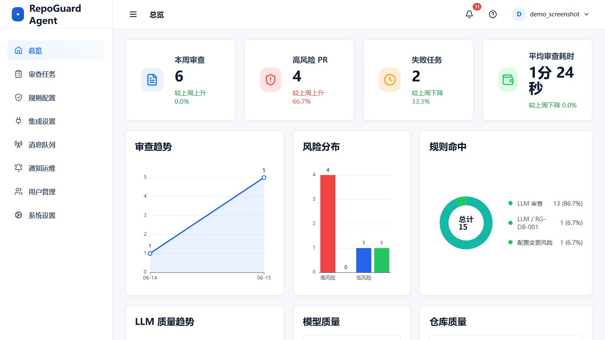
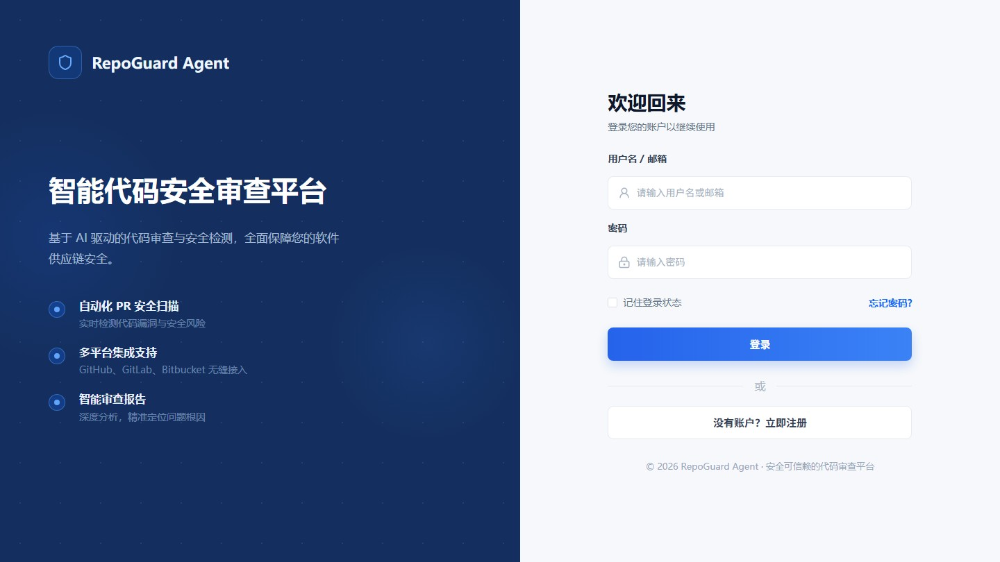
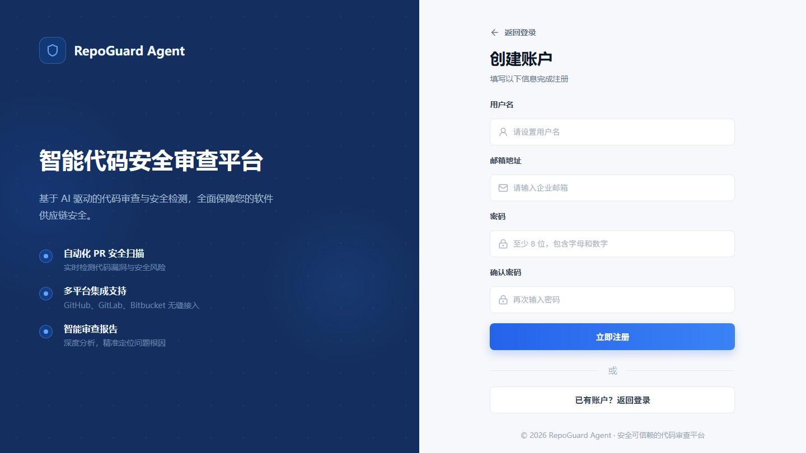

# PRAgent

RepoGuard Agent 是面向 GitHub Pull Request 的代码审查辅助系统，包含 Spring Boot 后端与 Vue 3 管理台。系统通过 RabbitMQ 异步执行审查任务，结合规则和 LLM 生成审查发现，并支持结果展示、人工确认、评论预览、GitHub 回写和本地观测。

## 核心功能

- PR 审查任务创建、重试、状态追踪和详情展示。
- 个人版待人工复核队列：在审查任务页切换“待人工复核”，按仓库、风险等条件筛选当前仍需人工决定的任务；进入详情使用既有复核与 Finding 反馈功能，写操作仍受管理员权限约束。
- GitHub open PR 选择、diff 拉取、行评论和 PR 总评回写。
- 规则审查与 LLM 审查结合，支持 fallback、结果解析、Finding 去重和风险画像。
- RabbitMQ 异步执行、发布确认、失败补偿和异常任务运维。
- 用户认证、管理员 API Key、RBAC、审计日志和敏感配置加密。
- Dashboard 指标、质量趋势、通知运维、消息队列健康和日志观测。
- 企业版租户与仓库管理台：租户切换、GitHub App installation 绑定、成员/OIDC 绑定和配额管理。

## 界面预览

“待人工复核”视图仅包含任务状态为 `PENDING_HUMAN_REVIEW`、需要人工复核且复核状态为 `PENDING` 的任务。列表和总数使用相同服务端条件，刷新或从详情返回时重新查询；已完成决定的任务不再进入队列。入口不依赖企业版，也不提供领取、分派、SLA 或批量写操作。







## 技术栈

后端：

- Java 25
- Spring Boot 4
- MyBatis-Plus
- MySQL 8 + Flyway
- RabbitMQ
- Micrometer / Actuator
- JUnit / Mockito / Spring Test

前端：

- Node.js >= 20.19.0
- Vue 3
- Vite 7
- TypeScript
- Element Plus
- ECharts
- lucide-vue-next

## 项目结构

- `repoguard-backend/`：Spring Boot 后端，提供审查任务、配置、GitHub 集成、LLM/规则审查、评论回写和运维 API。
- `repoguard-frontend/`：Vue 3 + Vite + TypeScript 前端管理台。
- `config/`：本地和示例配置。
- `.github/workflows/`：质量检查、镜像构建和仓库治理工作流。
- `.github/workflow-catalog.txt`：CI、发布和维护入口的引用清单与时长基线。

## 环境要求

- JDK：25（Maven Enforcer 会拒绝其他主版本）
- Maven：3.9.9+（低于 4.0.0）；无需全局安装，仓库内 Wrapper 固定使用 3.9.16
- Node.js：建议使用 Node 22，最低要求 `>=20.19.0`
- Docker / Docker Compose：用于启动 MySQL、RabbitMQ 和本地观测组件

仓库根目录提供 `.nvmrc`，前端开发建议使用该版本。后端构建统一通过 Maven Wrapper 进入：

```powershell
cd repoguard-backend
java -version
.\mvnw.cmd -version
.\mvnw.cmd validate
```

macOS / Linux 使用对应入口：

```bash
cd repoguard-backend
java -version
./mvnw -version
./mvnw validate
```

## 快速启动

启动后端依赖：

```bash
cd repoguard-backend
docker compose up -d
```

启动后端：

```bash
cd repoguard-backend
./mvnw spring-boot:run -Dspring-boot.run.profiles=dev,local
```

默认后端地址：

```text
http://localhost:8081
```

启动前端：

```bash
cd repoguard-frontend
npm install
npm run dev
```

默认前端地址：

```text
http://localhost:5173
```

前端开发服务默认通过 Vite `/api` 代理访问后端 `http://localhost:8081`。

## 常用命令

后端全量测试：

```bash
cd repoguard-backend
./mvnw test
```

后端打包：

```bash
cd repoguard-backend
./mvnw -DskipTests package
```

前端质量检查和构建：

```bash
cd repoguard-frontend
npm run quality
npm run build
```

后端 Controller 或 DTO 契约变更后，重新生成前端 OpenAPI 客户端元数据：

```bash
cd repoguard-frontend
npm run generate:api
```

仓库级代码质量检查：

```powershell
powershell -ExecutionPolicy Bypass -File scripts/production-readiness-check.ps1 -Mode quick -SkipBackendTests
```

该检查用于代码、迁移和仓库治理门禁，不代表生产环境验收。

## 配置说明

常用的非敏感运行参数包括：

- `SPRING_PROFILES_ACTIVE`
- `REPOGUARD_RUNTIME_ROLE`：`combined`、`api` 或 `worker`
- `REPOGUARD_DEPLOYMENT_MODE`：`monolith` 或 `split`
- `REPOGUARD_API_INSTANCE_COUNT`
- `REPOGUARD_RATE_LIMIT_STORE`：单实例使用 `local`，多实例使用 `database`
- `REPOGUARD_REVIEW_WORKER_CONCURRENCY`
- `WORKER_CPU_LIMIT`、`BACKEND_MEM_LIMIT`、`WORKER_MEM_LIMIT`
- `REPOGUARD_GITHUB_WEBHOOK_ALLOWED_REPOSITORIES`
- `REPOGUARD_GITHUB_WEBHOOK_ALLOWED_HEAD_BRANCHES`
- `REPOGUARD_GITHUB_CHECK_RUN_ENABLED`：启用 GitHub Checks 合并门禁（需要 GitHub App）
- `REPOGUARD_GITHUB_CHECK_RUN_NAME`：分支保护中配置的必需状态检查名称，默认 `RepoGuard PR Review`

敏感配置必须通过本地未跟踪的环境文件、文件化 Secret 或受保护的 CI Secret 注入。README 不保存真实密码、令牌、API Key、私钥、主机地址、主机指纹、备份位置或镜像仓库凭据；示例只允许使用占位符。缺少必要凭据时，应用和工作流应保持 fail-closed。

### 独立 Linux 质量检查

已有 `Repository Governance` 工作流提供默认关闭的 `linux_quality` 手动选项。需要验证未创建 PR 的候选分支时，选择该分支并开启此选项；仓库治理通过后，复用 `Pull Request Quality` 的 Ubuntu 检查，运行后端、前端、临时 MySQL/RabbitMQ 和迁移验证。也可使用 `gh workflow run repository-governance.yml --ref <候选分支> -f linux_quality=true`。该入口仅授予仓库读取权限，不传递生产 Secret，不创建 PR、推送镜像或连接生产主机；依赖差异审查仍仅在 PR 事件运行。它验证 runner 上实际执行的检查，不能替代生产调度、恢复、代理流式传输或真实业务验收。

### 可选服务器定时数据库备份

`deploy/systemd/repoguard-mysql-backup.{service,timer}` 提供独立于操作电脑的日常加密 MySQL 逻辑备份。默认不安装、不启用；生产启用须先完成备份与恢复预检。需要 Linux、systemd（支持 `LoadCredential`）、Python 3.8+、Docker、Bash 和 OpenSSL。将两个生产脚本 `scripts/scheduled-mysql-backup.py`、`scripts/backup-prod-mysql.sh` 安装到单元配置中的脚本目录，创建单元指定的备份父目录，并用受保护的运维通道配置 `LoadCredential` 指向的密钥文件（仅 root 可读，至少32字节）。密钥必须另行离线保管，不写入命令行、Git 或日志。

经审批启用 timer 后，每天北京时间20:00加最多5分钟随机延迟执行；服务器停机错过的计划在恢复后补执行一次。失败15分钟后重试，1小时内最多启动3次。独立目录和互斥锁隔离调度产物；仅在新备份完成解密/gzip验证和 SHA256 核对后清理旧的已验证副本，保留最多7份、目标总量2 GiB。单份超出预算时保留最新副本并报告超预算，后续运行停止，需人工处理；不会为腾出空间删除唯一备份。服务资源限制不限制 MySQL 容器内的 dump，因此首次启用仍需检查业务负载。

在服务器运行 `python3 /opt/repoguard/scripts/scheduled-mysql-backup.py status` 查看最近执行记录；可用 `--max-age-hours 30` 设置记录新鲜度（1～168小时，默认30小时）。输出 JSON，最近成功且未超存储预算时退出0，16分钟以内的运行中记录退出1，失败、过期、超时未结束、缺失或无效记录退出2。查询只读取有界状态文件，不读取密钥或解密备份，也不检查进程存活、timer 是否启用、归档当前完整性或恢复能力；`SUCCESS_RECORDED` 仅表示记录成功。结合 `systemctl status repoguard-mysql-backup.timer repoguard-mysql-backup.service` 和 `journalctl -u repoguard-mysql-backup.service` 诊断实际调度与中断，失败不会自动发送外部通知。电脑上线后使用已有 OpenSSH 别名补拉当前保留的已验证加密副本：

```text
python scripts/scheduled-mysql-backup.py pull --host <已配置SSH别名> --destination <本地加密备份目录>
```

拉取要求已登记的主机指纹和非交互认证。远端目录清单最多64 KiB，单次清单的归档总量最多2 GiB；下载过程中限制写入量，超量、超时或连接失败时终止，校验长度与 SHA256 后才发布本地文件。目标目录应使用支持硬链接的本地文件系统（如 NTFS、ext4），不通过符号链接或目录联接访问；原子发布拒绝覆盖下载期间由其他进程创建的目标，不支持硬链接时直接失败。相同副本跳过，冲突副本和已有元数据拒绝覆盖；仅清理本次创建的临时文件，已有 `.partial` 文件需人工核查后处理。离线时间超过服务器保留窗口的旧备份不能补回。停止调度使用 `systemctl disable --now repoguard-mysql-backup.timer`；需要中止当前运行时另行停止 service，停止操作不会删除已完成副本。

日常产物仅包含数据库逻辑快照，不包含配置、Secret、消息队列或上传卷，不提供 PITR，也不执行恢复容器。完整一致备份、同版本全栈恢复演练和异地副本必须分别维护。

系统设置页提供仅系统管理员可见的备份状态卡片。接口 `GET /api/v1/system/backup-status` 默认返回未配置；不允许租户管理员、审查员或只读用户读取主机级元数据。启用前由运维创建 `/opt/repoguard/backup-status`（root 所有、0755、禁止组和其他用户写入）；systemd 单元将执行状态的受限投影写入此目录，文件0644，只包含时间、状态、份数、大小及固定原因码，不包含备份路径、归档哈希或密钥。投影失败不会中止数据库备份，页面会显示缺失或旧记录。

在已审核的部署配置中显式叠加 `docker-compose.backup-status.yml`，仅向 API 只读挂载上述状态目录；每次部署均需保留该覆盖配置。不要把备份或密钥目录挂进应用。该覆盖文件设置 `REPOGUARD_BACKUP_STATUS_FILE`；直接运行后端时也可将其指向已发布的绝对状态文件路径，以 `REPOGUARD_BACKUP_STATUS_MAX_AGE_HOURS` 调整1～168小时的新鲜度。页面只在打开及人工刷新时查询，不触发备份操作；状态成功不代表已验证恢复。关闭该集成只需移除状态文件配置和只读挂载，不删除备份。

### 可选审查进度推送

后端设置 `REPOGUARD_REVIEW_PROGRESS_STREAM_ENABLED=true`，前端构建设置 `VITE_REVIEW_PROGRESS_STREAM=true`，可启用任务详情 SSE 进度更新；两个开关默认关闭。端点为 `GET /api/v1/reviews/{id}/events`，使用普通用户 Bearer 会话和现有租户请求头，不接受 URL 凭据或长期管理员 Key。

正式镜像通过手动 `Release Images` 的 `frontend_progress_stream=true` 构建前端 SSE 变体；普通推送和省略该输入时仍关闭。变体版本追加 `-sse`，签名清单记录构建选项并核对前端镜像标签；复用源清单时必须选择相同选项，默认镜像与 SSE 变体不能混用。仅构建时保持 `deploy=false`；实际生产发布及后端开关启用仍需单独授权和线上验收。回滚使用原已批准清单，保留原镜像的构建选项。

事件仅携带任务标识和持久化 timeline 游标，客户端收到后读取既有状态接口；中间事件可合并，不用于审计回放。每次连接均重新同步当前状态，`Last-Event-ID` 不能跳过鉴权。API 每5秒重新检查账号、会话、租户成员资格和任务存在性；停用账号或撤销权限后最迟受账号缓存5秒及采样周期影响关闭连接。

每实例最多16连接、每用户最多2连接，最长连接120秒，正常110秒轮换。服务重启或历史归档后从持久化当前状态恢复或回退轮询；浏览器隐藏、断网、20秒无数据或连续3次短连接失败时释放连接并使用现有页面感知轮询。代理需允许 SSE 并尊重 `X-Accel-Buffering: no`；前端构建及后端开关应配套启用。Worker 不持有流连接，不修改 RabbitMQ 消费事务。

### 离线 Diff 预审与代码所有者建议

先用项目要求的 JDK/Maven 打包后端，在有 Python 3.8+、Git 和同版本 Java 的电脑执行：

```text
python scripts/repoguard-review.py --repo <仓库目录> --base origin/main --backend-jar <后端可执行jar>
python scripts/repoguard-review.py --repo <仓库目录> --base origin/main --staged --backend-jar <后端可执行jar> --format sarif --output <新的报告文件>
python scripts/repoguard-review.py --repo <仓库目录> --base origin/main --include-untracked --full-context --backend-jar <后端可执行jar> --format json
```

默认比较基础分支与 HEAD 的 merge-base 到已跟踪工作区的差异，包含提交、暂存和未暂存修改；`--staged` 比较 merge-base 到索引。`--include-untracked` 可额外扫描未被 Git 忽略的新文件，不能与 `--staged` 同用。按 Git 50% 相似度识别重命名，报告保留新旧路径，CODEOWNERS 建议覆盖两者；未识别的移动仍表现为删除和新增。删除文件只保留差异上下文；二进制、子模块和其他纯元数据变化列为未完成范围。

`--full-context` 为已有上下文感知规则加载同一索引或工作区中的完整文件，默认仍只传 diff。文件内容留在本机且不写入报告，不宣称来自远端提交；扫描仍限于变更行，不能替代完整 PR 审查。工作区内容读取支持 Windows 和具有 `/proc/self/fd` 的 Linux，拒绝符号链接、Windows 重解析点和越出仓库的文件句柄；无法读取请求的上下文时报告缺口并退出2。浅克隆缺少基础提交时直接提示失败，不联网补取；detached HEAD 只要能解析基础提交即可使用。每次最多200个文件、单文件内容或 patch 各256 KiB、diff 加完整上下文共2 MiB；限制超出或采集中检测到改动时拒绝生成成功结论。

CLI 启动独立的 Java 主类，复用服务端14个内置规则检测器及结果去重逻辑，不启动 Spring 应用、数据库、MQ 或模型调用。默认策略是显式标记的离线 OBSERVE 基线（MEDIUM 严重级别、80置信度），不等同生产仓库策略。可用 `--policy <JSON文件>` 提供本地 `ReviewRuleSettings` 数组，要求内置规则 ID、检测器版本和配置版本有效；不支持声明式规则、不自动下载生产配置，输出始终标明生产策略未验证。

支持终端摘要、JSON、SARIF；报告不包含原始 diff 或凭据。默认发现问题仍退出0，`--fail-on MEDIUM` 等参数显式开启本地严重级别门禁后命中退出1；执行失败或范围不完整退出2。`--output` 只创建新文件，不覆盖已有报告。预审不创建正式任务、不发布评论或 Check Run，不进入质量准入样本或绩效统计。

CODEOWNERS 只从指定基础分支读取，按 `.github/CODEOWNERS`、根目录、`docs/CODEOWNERS` 顺序选第一个文件。支持大小写敏感路径、`*`、`?`、`**`、目录规则、后匹配覆盖及空所有者清除；不支持的转义/否定/字符组规则会给出行号提示。文件最多128 KiB、2000行；解析问题仅影响推荐，不阻止规则预审。输出最多3个按覆盖文件数排列的外部身份及每条路径的匹配依据、未覆盖列表，不验证 GitHub 写权限或映射租户成员，不自动分派。语义依据：[GitHub CODEOWNERS 文档](https://docs.github.com/en/repositories/managing-your-repositorys-settings-and-features/customizing-your-repository/about-code-owners)。

### 在线 CODEOWNERS 复核推荐

该入口仅装配于 `enterprise-experimental` API，默认关闭。开启前应具备真实仓库的合法读取权限、至少 30 次可追溯的人工分派或领取记录，以及可计算的接受率和 SLA 数据。设置 `REPOGUARD_CODEOWNERS_ROUTING_ENABLED=true` 与 `REPOGUARD_CODEOWNERS_MAPPING_FILE`；映射文件必须是 API 进程可读的绝对规范路径、普通文件，不能经过符号链接，内容不超过 256 KiB。映射由运维配置，HTTP 调用者不能上传映射或自授所有者权限。

映射文件是 JSON 数组，按租户 ID 和完整仓库名隔离；外部身份必须精确匹配，并映射到系统用户 ID。例如：

```json
[{"tenantId":7,"repository":"owner/repo","owners":{"@owner/backend":[11,12],"reviewer@example.com":[13]}}]
```

任务详情页的推荐入口仅对管理员、租户管理员和复核成员开放，适用于当前批次的待人工复核任务。点击“查看推荐”后，系统从 PR 的不可变 base 提交按 `.github/CODEOWNERS`、根目录、`docs/CODEOWNERS` 顺序读取规则，最多展示 3 位候选人、匹配依据、覆盖范围及未覆盖路径。候选人必须仍为当前活动租户的有效复核成员；外部所有者文本不会直接成为系统用户名。

“接受推荐并分派”需要用户明确点击。服务端重新查询候选人、校验提交与批次，在事务中检查成员资格，并以任务版本和原分派状态约束更新；过期推荐或并发分派变化返回冲突。推荐查询不自动写入分派，不发布 GitHub 评论，也不代替仓库的必需审查策略。查询和接受接口分别为 `GET /api/v1/review-workflow/tasks/{taskId}/codeowners` 和 `POST /api/v1/review-workflow/tasks/{taskId}/codeowners/accept`，响应禁止浏览器缓存。

企业版任务详情也提供独立的“人工选择复核成员”入口，不依赖推荐开关。可按用户名开头查找当前租户的有效复核成员，每次最多显示 20 位；只有选择成员并点击“确认分派”才写入。确认携带任务批次、提交和原分派版本，服务端按成员 ID 重新检查并锁定资格，版本或资格变化时需刷新后重新选择。该入口不会展示账号邮箱或凭据，个人版不装配。成员查询和确认分别使用 `GET /api/v1/review-workflow/tasks/{taskId}/assignment-options` 与 `POST /api/v1/review-workflow/tasks/{taskId}/assignment/confirm`，响应禁止缓存。

重命名同时匹配新旧路径的 base 规则；同一候选人的文件数、风险和 Finding 按实际变更去重，页面保留旧路径及其关联变更的依据。旧路径由 [GitHub PR 文件列表](https://docs.github.com/en/rest/pulls/pulls#list-pull-requests-files) 补取，读取前后校验 PR 版本，远端文件集合必须与当前批次一致。只保留路径元数据，不加载文件上下文；最多读取 3 页、200 个实际变更文件和 512 KiB 的路径元数据，60 秒单调时间预算超限后回退。

规则文件最多 128 KiB、2000 行；支持的 glob 子集和离线 CLI 一致，含重命名前路径的唯一匹配路径最多 200 个，所有者标识最长 255 字符。无法解析、缺失配置、没有合格成员、预算超限或缺少重命名前路径时显示原因并保留人工分派。运维映射的解析缓存最多 8 个租户/仓库/内容指纹条目，60 秒单调时间过期；每次仍重新读取映射文件、任务版本和成员资格，不缓存最终候选人。关闭开关后立即停止推荐查询与接受分派。


需要使用文件化 Secret 时，应用支持以 `*_FILE` 形式传入路径，例如：

- `MYSQL_ROOT_PASSWORD_FILE`
- `MYSQL_PASSWORD_FILE`
- `REPOGUARD_SECURITY_ENCRYPTION_KEY_FILE`
- `REPOGUARD_SECURITY_ENCRYPTION_SALT_FILE`
- `REPOGUARD_AUTH_TOKEN_SECRET_FILE`
- `REPOGUARD_ADMIN_API_KEY_FILE`
- `REPOGUARD_GITHUB_WEBHOOK_SECRET_FILE`

不要把这些变量的实际值写入 Git、命令参数、Shell 历史、容器镜像或日志。

GitHub Checks 合并门禁：

1. GitHub App 需要 `Checks: Read and write`、`Pull requests: Read and write`、`Contents: Read` 和 `Metadata: Read` 权限，并订阅 `pull_request`、`check_run` webhook。
2. 设置 `REPOGUARD_GITHUB_CHECK_RUN_ENABLED=true`，并确保租户仓库绑定到该 App installation；系统会按 `queued → in_progress → completed` 顺序写入 Check Run。
3. 在 GitHub 分支保护规则中，将 `REPOGUARD_GITHUB_CHECK_RUN_NAME`（默认 `RepoGuard PR Review`）设为必需状态检查。BLOCK Finding 会产生 failure annotation，人工复核期间为 `action_required`；Check Run 页面自带的 Re-run 会触发新一轮审查。

企业版租户与 RBAC：

1. 将前端 edition 设置为 `enterprise-experimental`，登录后平台管理员从“租户与仓库”进入控制台；所有写操作继续受服务端角色和乐观版本校验保护。
2. `PLATFORM_ADMIN` 管理租户控制面，`TENANT_ADMIN` 管理租户成员，`RULE_ADMIN` 管理规则，`REVIEWER` 执行审查，`READ_ONLY` 只读；`ADMIN`/`VIEWER` 作为兼容角色保留。
3. 顶部租户切换器把选择写入 `X-RepoGuard-Tenant` 请求头，不把租户标识放入 URL；启用 `REPOGUARD_TENANCY_ENABLED=true` 后，服务端只接受当前用户拥有的租户成员关系。

仓库级语义上下文：

1. LLM 审查会从变更文件提取类型/文件名符号，在 GitHub 默认分支树中确定性检索同目录调用方、实现/接口、测试和运行配置，并将命中内容作为关联上下文。
2. 检索使用受限的 Caffeine 缓存和内容/文件/时间预算，不执行仓库代码；GitHub 未配置、默认分支不可用或请求失败时自动降级为仅使用 PR 变更上下文。
3. 可通过 `REPOGUARD_LLM_SEMANTIC_INDEX_ENABLED`、`REPOGUARD_LLM_SEMANTIC_INDEX_MAX_FILES`、`REPOGUARD_LLM_SEMANTIC_INDEX_MAX_FILE_BYTES`、`REPOGUARD_LLM_SEMANTIC_INDEX_MAX_TOTAL_BYTES`、`REPOGUARD_LLM_SEMANTIC_INDEX_TIMEOUT_MS` 和缓存大小/TTL 变量调整预算。当前实现只做符号和路径检索，向量检索留待后续评估。

GitHub suggestion 一键修复：

1. 只有定位到变更行的 finding 才允许生成建议；`fixExample` 必须是完整替换代码块（例如 ```java ... ```）或 `suggestion:` 前缀，最多 5 行、4,000 字符，普通自然语言会被拒绝。
2. 评论中会显示原生 `suggestion` 代码块和“请先确认”提示，作者可在 GitHub 页面确认后应用；系统不会自动提交作者分支，也不会为不完整证据创建修复 PR。
3. 删除文件、PR 总评、已发布/非 actionable finding 和包含嵌套代码围栏或控制字符的内容不会生成可应用建议。

LLM 评测与模型发布中心：

1. 企业管理员可在 `/api/v1/config/review-calibration/release-center` 查看按租户隔离的影子版本、灰度版本、当前版本、历史质量对比和当月 token/费用预算；版本只接收数据集 ID、版本和 SHA-256 指纹等聚合证据，不保存原始 prompt 或模型响应。
2. 通过 `/shadow` 登记候选版本，只有 precision ≥ 90%、recall ≥ 80%、锚定率 ≥ 95%、重复率/解析失败率 ≤ 5%、p95 ≤ 15 秒且数据集质量门禁通过后，才能按 1–99% 灰度或 100% 全量发布；同一租户同一 `releaseKey` 会幂等更新。
3. 灰度路由使用审查任务 ID 的确定性桶分配，重试不会改变模型；运行时发现质量指标不安全或月度预算耗尽会自动回滚/停用 LLM 并回退规则审查。租户配额中的 `monthlyLlmTokenBudget` 与 `monthlyLlmCostBudget` 为 0 表示不设上限。
4. 受控数据集清单可使用 `PROVISIONAL_REAL_PR` 运行单仓库、20～49 个真实 PR 的小样本验收；仍须完成授权、脱敏、人工复核、固定/滚动分片和 SHA-256 指纹。报告会标记为 `PROVISIONAL`，可查看、比较和导出，但不能注册 Shadow 或晋级 Canary/Active。正式 `REAL_PR` 门禁仍要求 2～3 个仓库和 50～100 个样本。

运行角色边界：

- `combined` 同时提供 HTTP API、RabbitMQ 消费者和受数据库保护的定时任务。
- `api` 只提供 HTTP API；`worker` 负责消息消费和后台任务。
- `monolith` 必须搭配 `combined`；`split` 必须使用 `api` + `worker`。
- 横向扩展 API 前必须确认共享限流、数据库连接和缓存失效策略已经启用。

共享限流默认使用 `local`。选择 `REPOGUARD_RATE_LIMIT_STORE=database` 时，认证请求仅在同一事务中递增和读取当前窗口计数；数据库或提交失败仍拒绝请求。过期窗口由 `worker`/`combined` 的全局租约任务清理，API 角色不执行清理。

后台清理默认每60秒运行，每批500行、每轮最多10批；只删除早于当前分钟减2的窗口。`REPOGUARD_RATE_LIMIT_CLEANUP_ENABLED=false` 可停止清理。`REPOGUARD_RATE_LIMIT_CLEANUP_INTERVAL_MS`、`REPOGUARD_RATE_LIMIT_CLEANUP_BATCH_SIZE`、`REPOGUARD_RATE_LIMIT_CLEANUP_MAX_BATCHES_PER_RUN` 和 `REPOGUARD_RATE_LIMIT_CLEANUP_MAX_RUN_MS` 可调整间隔和预算。默认3秒预算用于停止启动新批次，每条删除语句及事务另有2秒超时；它不是整轮执行的硬截止时间。

观测 `repoguard.security.shared_rate_limit.cleanup.deleted_rows`、`cleanup.backlog`、`cleanup.failed` 及 `cleanup.duration`。`backlog` 记录触及批数/时间上限的轮次，不表示剩余行数。清理失败不改变有效计数，认证计数失败仍记录 `repoguard.security.shared_rate_limit.fail_closed`。

## 本地日志观测

本地可以使用 Loki、Alloy 和 Grafana 查看 RepoGuard 日志。管理员密码只在当前 Shell 中临时设置，不要写入 README 或仓库文件：

```bash
export DOCKER_SOCKET_GID="$(stat -c '%g' /var/run/docker.sock)"
read -r -s GRAFANA_ADMIN_PASSWORD
export GRAFANA_ADMIN_PASSWORD
docker compose -f docker-compose.observability.yml up -d
```

Grafana 地址：

```text
http://localhost:3000
```

默认账号：`admin`

如果后端通过 Maven 或 IDE 本地启动，可将日志写入仓库根目录的 `logs/backend`：

```powershell
cd repoguard-backend
$env:REPOGUARD_LOG_PATH = "../logs/backend"
.\mvnw.cmd spring-boot:run
```

## 镜像发布与回滚

普通 PR 只进入 `Pull Request Quality` CI 主链路；镜像发布仅由 `main`/`master`、`v*` 标签或手动 `Release Images` 触发，`PRAgent-test` 推送不会发布镜像。生产部署默认关闭，不会因构建或测试自动连接服务器；需要时由维护者在 GitHub Actions 中手动启用，并在受保护环境配置凭据。各维护工作流的手动/定时入口和调用关系见 `.github/workflow-catalog.txt`。

手动启用部署时应遵循以下边界：

1. 使用已通过质量门禁并附可信发布清单的镜像，生产按目标仓库 `@sha256` 部署。
2. 服务器、镜像仓库、SSH 和备份凭据只从受保护的 Secret/Environment 读取。
3. 主机密钥必须离线核验并启用严格校验，禁止运行时自动信任未知主机。
4. 回滚只选择已验证的旧镜像，不删除数据库或消息队列数据卷。
5. 任一凭据、镜像或健康检查缺失时立即停止，保持 fail-closed。

构建成功后保存签名的源发布清单，绑定 Git SHA、Release Images 的 run/attempt、源镜像 digest、平台镜像 ID、扫描/SBOM 结果和 schema 要求。普通手动发布优先复用同一 SHA 的已验证构建；`release_run_id` 可明确指定源构建。复用前校验 GitHub artifact attestations 的仓库、工作流、Git SHA、ref 和运行身份。

推广到 ACR 后重新读取目标 digest 并核对平台镜像 ID；源、目标 manifest digest 可以不同。受保护的生产环境批准后保存签名的目标清单。手动回滚需同时指定 `deploy_existing_tag` 和该版本成功部署的 `release_run_id`，按清单中的目标 digest 拉取；标签被改写不会改变选定镜像。缺少可信清单、过期制品或未成功的源运行会拒绝部署。GitHub 清单制品保留90天，长期留存应保存签名清单及其验证材料。

部署主机需提供 Python 3 标准库运行环境。`deploy-prod.sh` 在拉取前验证清单 SHA256、批准运行及目标仓库，拉取后核对预期 SHA/版本/镜像 ID，启动后验证 Compose MySQL 的 Flyway schema。API 仍先执行迁移，Worker 后启动；自动故障回滚保留已运行镜像的不可变 ID。应用回滚不会撤销数据库迁移，涉及不兼容数据变更时需独立恢复方案。

首次采用清单发布时，应先记录当前运行版本、镜像 ID 和配置备份，并验证旧应用对扩展后 schema 的兼容性。首次部署失败可尝试自动恢复先前运行镜像；成功部署后，尚无批准清单的历史版本不能通过 `deploy_existing_tag` 手动回滚，需要另行审阅的恢复方案。普通分支的手动构建仍执行质量与镜像扫描，但仅 main/master 和版本标签生成可复用的可信源清单。

本项目按个人项目范围维护，不做生产环境验收；生产工作流保持默认关闭，代码和 CI 门禁不构成线上部署证明。

## API 入口

主要后端接口前缀为 `/api/v1`：

- `/api/v1/auth/**`：注册、登录、刷新、当前用户、登出。
- `/api/v1/dashboard/**`：总览统计、趋势、风险分布、通知摘要。
- `/api/v1/reviews/**`：审查任务列表、详情、手动触发、重试、评论预览与回写。
- `/api/v1/github/webhooks`：GitHub `pull_request` 自动触发审查，`check_run.rerequested` 支持页面重新运行。
- `/api/v1/config/**`：系统设置、集成配置、连接测试和密钥重加密。
- `/api/v1/message-queue/**`：RabbitMQ 健康、异常任务和重新入队。
- `/api/v1/users/**`：用户管理。
- `/actuator/health`、`/actuator/info`、`/actuator/metrics`：健康检查和指标。

API 响应通常使用统一 `ApiResponse` 包装。业务错误优先使用稳定 `ErrorCode`。

评论回写历史保留原 `/reviews/{id}/github-comments/publications` 完整内嵌明细契约。新界面使用 `/publications/batches` 获取摘要及 `itemsTotal/hasMore`，展开后通过 `/publications/{batchId}/items?afterId=0&pageSize=20` 按游标加载；明细每页最多100条。先发布包含新接口及覆盖索引迁移的后端，再发布前端。

## LLM 费用估算

新配置的输入、输出单价统一使用人民币（CNY）/百万 tokens；费用上限也使用人民币。
请按实际模型、地域和输入长度核对供应商报价，不要把美元价格直接填入人民币字段。
费用由输入、输出用量乘对应单价估算，不是供应商账单；固定单价不自动适配阶梯、Batch、免费额度或账户折扣。
缓存输入单价可单独配置，留空表示未知，显式 `0` 表示缓存输入免费。兼容 Chat Completions 的 `usage.prompt_tokens_details.cached_tokens` 属于 `prompt_tokens` 的子集，普通输入为总输入减缓存输入；缺失或无效的缓存量保留为未知，按完整输入保守计价。
新调用保存当次单价、计价版本、CNY 币种和估算来源快照；配置变更不会重算历史费用。缓存单价未知时按完整输入保守估算，预算预留不预先假定缓存命中或优惠。
输入、输出单价均为正数且用量拆分完整时才产生可确认的调用估算；未配置、缺失和历史聚合的 0 不代表免费。
失败或取消后，未知用量的调用可能保留保守预算预留，不得将其当作实际扣费。
未配置价格时，费用上限不能约束真实账单，必须同时设置 token 和时长上限。
历史不可变评估报告保留原始金额，不换算、不回填；原来使用其他币种的部署必须先隔离旧统计口径，不能混合汇总。

## 指定样本诊断

在质量评估工作台开启“指定样本诊断”，输入受控数据集中的样本 ID（逗号或换行分隔），再设置并发、token、人民币估算费用和时长预算。接口沿用评估运行请求，传入非空 `sampleIds` 数组开启诊断；省略该字段仍执行正式评估。样本 ID 去重后最多 100 个，必须属于当前已授权数据集，不接受文件路径。

诊断只调度选中的样本。结果展示逐样本状态、失败分类和已记录用量，失败或取消不计入成功数；运行结束不代表每条样本都成功。诊断不生成质量报告，不能用于模型晋升。未知费用显示未计价，运行合计可能包含中断请求的保守预算预留，不能当作供应商账单。

运行 ID 可用于重新查询或取消；重启后保留已落库摘要，超过原执行期限的中断运行标记失败，不自动重放付费请求。关闭诊断入口或回退应用时保留新增的可空字段，不回填历史报告、不删除已发布迁移。

反馈与评估运行的载荷保留：

- 管理员可先调用 `GET /api/v1/config/data-retention/payload-preview` 查看当前租户候选数量、最老时间和载荷字节上界；预览不执行清理。
- `REPOGUARD_FEEDBACK_PAYLOAD_PURGE_ENABLED`、`REPOGUARD_EVALUATION_RUN_PAYLOAD_PURGE_ENABLED` 默认均为 `false`；对应 `*_PAYLOAD_RETENTION_DAYS` 默认90天，最少30天。启用前应审阅预览范围，保存备份并验证隔离恢复。
- 清理只处理过期终态载荷：反馈的备注/操作者和未引用报告的评估运行目录/操作者/逐样本诊断。`retention_protected=true` 的记录、运行中的任务、可重试 FAILED 反馈、报告引用及关联抑制审计范围均排除。
- delivery/comment/run_key、终态、汇总及诊断样本选择保留为持久去重凭据，不删除整行。清理后旧事件和旧运行键仍返回已有结果，不重新发布或调用模型；清理不会减少去重行数。
- 清理复用租户定时任务租约、短批事务及审计；每批最多配置的 batch-size，每轮最多 max-batches-per-run。关闭开关即停止新增清理，已清理载荷只能从备份恢复，应用回退不能恢复载荷。

## GitHub 评论反馈

在现有 Webhook 上订阅 `pull_request_review_comment`，配置签名和明确的仓库白名单，并在 API/Worker 同时设置 `REPOGUARD_GITHUB_FEEDBACK_ENABLED=true`。默认关闭；签名关闭或白名单为空时保持不可用。集成凭据需要能读取 PR 评论和仓库成员权限。

第一版仅处理已发布行评论下的新回复：`/repoguard false-positive 原因`、`/repoguard ignore 原因`。不处理普通讨论、编辑事件、机器人、PR 总结评论或修复命令。后台读取 GitHub 核验写权限、原评论与当前 head，再校验当前 attempt；过期、重复或已有更新反馈的事件会被忽略。误报复用现有抑制提案流程，不自动激活。

集成配置页可查看最近反馈处理状态并重试失败事件。每轮最多处理 10 条，失败间隔 60 秒、最多 5 次；成功事件不能重放。关闭开关即停止接收和处理，历史诊断仍可读。新增表只保存命令元数据、脱敏原因与正文指纹，不保存原始 Webhook 或 GitHub 响应；本功能不向 GitHub 自动回复。

## CI SARIF 接入向导

管理员可在当前任务详情打开“接入 CI 扫描结果”，查看仓库、PR、当前 attempt、绑定 commit 和最近 20 条成功上传记录。记录限定当前 attempt 与 commit，显示实际导入批次是否已被替换；失败请求需查看 CI 的 HTTP 响应。

沿用已有 CodeQL 或 Semgrep 扫描，将单个 run 的 SARIF 2.1.0 JSON 保存为 `codeql.sarif` 或 `semgrep.sarif`，再复制 GitHub Actions、GitLab CI 或通用 Shell 上传片段。运行环境需要 Python 3、Git、对应 PR head commit 和访问 RepoGuard 的网络权限。JSON 上限为 2,000,000 字节；片段从报告读取扫描器名称/版本，并拒绝 HTTP 重定向。

SARIF 导出包含当前审查的 findings，按扫描器名称与版本分组。默认最多 10,000 条 finding、8 MiB UTF-8 SARIF 文档，超过任一上限会返回明确错误，结果不会被截断。查询前也会检查待加载的消息、路径和规则标识文本总字节数，使用同一字节上限。可通过 `REPOGUARD_SARIF_EXPORT_MAX_FINDINGS`（1 至 100,000）和 `REPOGUARD_SARIF_EXPORT_MAX_DOCUMENT_BYTES`（1,024 至 33,554,432）调整；API 响应封装不计入文档字节预算。小规格实例建议保持默认或降低上限。

每次导入最多 20 个 run、5,000 个 result。普通导入与 CI 上传都会在解析完成后重新核对任务、attempt 和 commit；准备期间任务被重试时返回冲突，需要重新获取绑定。报告批次、finding、旧批次替代状态及 CI 上传记录在同一事务中提交，任一步写入失败都会整体回滚。

第一版用于手动接入验收：报告生成后获取 10 分钟短期凭证，再启动读取已有报告的上传作业，或下载报告后运行通用片段。凭证通过 `REPOGUARD_CI_CREDENTIAL` secret 注入，上传后删除临时 secret；不可作为长期定时任务凭证。真实凭证不会进入片段、页面正文或浏览器存储，复制、关闭向导、刷新绑定或过期后清除页面持有的值。重试相同报告时保持 `SARIF_SCAN_RUN` 不变；任务重试或 commit 更新后需要重新获取绑定与凭证。

企业版人工分派及机器人分派仅接受当前租户内启用的审查成员（ADMIN、PLATFORM_ADMIN、TENANT_ADMIN 或 REVIEWER 成员角色）。停用账号、失效租户、非成员及只读/规则管理成员不能接收分派；用户名采用系统记录中的规范名称。清空分派不要求原接收者仍有效，便于回收失效成员的任务。

企业版人工复核超时后，升级扫描只选择仍待复核、未到升级上限且已过冷却期的任务。升级间隔默认 30 分钟，可通过 `REPOGUARD_HUMAN_REVIEW_ESCALATION_INTERVAL_MINUTES`（1 至 10,080）调整；升级上限仍默认为 3。扫描周期与业务升级间隔独立，重新分派、完成复核或状态变化后，旧候选不会触发升级。

企业版通知按超时复核、执行失败、高风险和 LLM 降级分别查询待处理候选，较早任务不会因新增普通任务而消失。超时任务按 SLA 顺序优先显示，系统配置提醒保留展示位置，其余类型轮流补齐；同一任务只显示优先级最高的一条提醒。复核已完成、已被替代或已重试的任务按当前状态退出对应待处理类别；标记已读只改变阅读状态。通知最多展示 12 条，`total` 表示本次展示条数，完整任务和待复核列表可从通知底部进入。

企业日报/周报在当前租户内一次聚合最近1/7天的任务，时间范围包含 `from`、不包含 `to`。完成数包括 `COMPLETED` 和 `APPROVED`；高风险数包括 `HIGH` 和 `CRITICAL`；待人工复核且 SLA 截止时间不晚于同一 `to` 的任务计入超时。空范围返回0，报表不加载完整任务实体。个人版仍受原有企业版条件开关保护。

Schema 期望版本为 V103；新增评论历史游标索引、可空的用量费用快照，以及默认不清理的载荷保留字段和候选索引。API 迁移所有者完成升级后再启动非迁移角色；迁移不回填历史费用，不删除历史记录。

## 开发规范

- 代码和配置中的凭据必须使用占位符；真实密钥、令牌、连接信息和本地日志不得提交。
- 只提交根目录 `README.md` 作为项目说明；其他 Markdown 和测试辅助脚本保持本地忽略。
- 后端代码使用 Maven Wrapper，前端代码使用仓库锁定的 Node.js 版本。
- OpenAPI 契约变更必须同步生成元数据和对应的后端/前端测试。
- 生产部署默认不执行；需要时必须由维护者手动启用并使用受保护凭据。

## License

This project is licensed under the MIT License. See [LICENSE](./LICENSE) for details.

## 人工反馈统计

审查任务页向管理员展示近 30 天最近最多 1000 条反馈的观察统计，按 RULE 与 LLM 分开展示有效、误报、人工确认修复和忽略数量，以及最近 20 条可追溯明细。只纳入当前执行、有效 PR 版本和有确认人的反馈；同一仓库、PR、版本和发现指纹去重，评估及缺少依据的记录排除。界面明确标记排除数量和样本截断，不代表全量统计；单来源不足 30 条显示“数据不足”，不推算质量百分比或节省收益。
