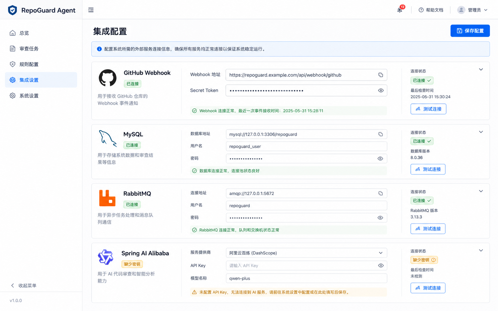
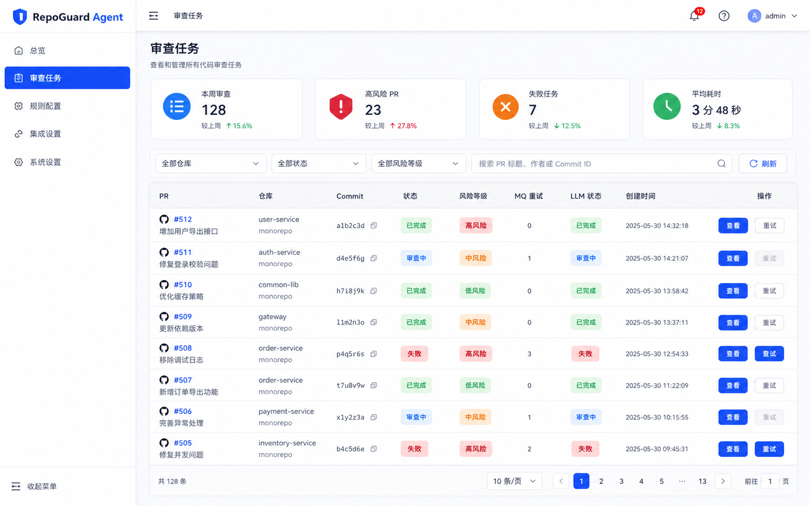
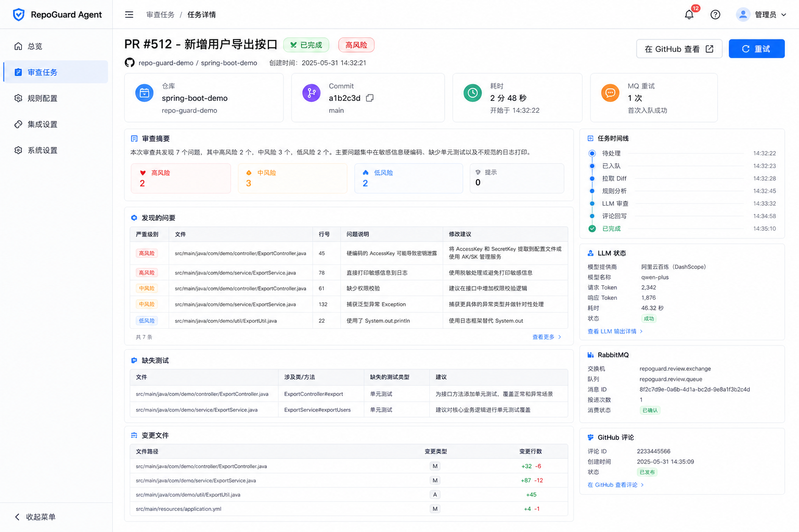
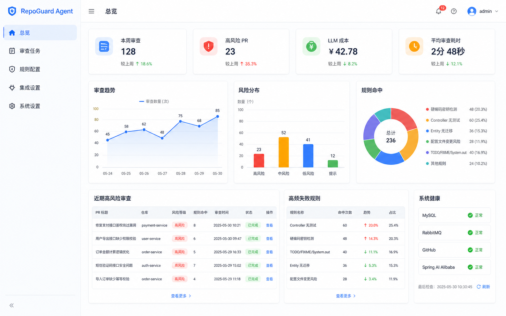

# RepoGuard Agent 前端需求说明

## 项目目标

RepoGuard Agent 前端用于展示 AI PR 审查系统的核心工作台。当前阶段先实现静态前端演示，所有业务数据来自本地模拟数据，后续再替换为真实后端 API。

## 技术栈

- Vue 3
- Vite
- TypeScript
- Vue Router
- Pinia
- Element Plus
- ECharts
- lucide-vue-next

## 页面范围

| 页面 | 路由 | 说明 |
| --- | --- | --- |
| 总览 | `/repoguard/overview` | 展示审查趋势、风险分布、规则命中、系统健康 |
| 审查任务 | `/repoguard/tasks` | 展示 PR 审查任务列表、筛选、分页和重试入口 |
| 任务详情 | `/repoguard/tasks/:id` | 展示单个 PR 的审查结果、时间线、LLM、MQ 和 GitHub 评论状态 |
| 集成配置 | `/repoguard/integrations` | 展示 GitHub、MySQL、RabbitMQ、Spring AI Alibaba 连接配置 |

## 模拟数据

模拟数据统一放在 `repoguard-frontend/src/mocks` 目录：

- `dashboard.ts`：总览统计和图表数据
- `reviewTasks.ts`：审查任务列表与详情数据
- `integrations.ts`：第三方集成配置数据

## 提交节奏

每个页面完成并构建通过后，立即提交并 push 到 GitHub 仓库：

1. 项目骨架、公共布局、文档和效果图资源
2. 总览 Dashboard
3. 审查任务列表
4. 任务详情
5. 集成配置
6. 最终样式修正与 README

## 效果图

### 集成配置

### 审查任务

### 任务详情

### 总览

